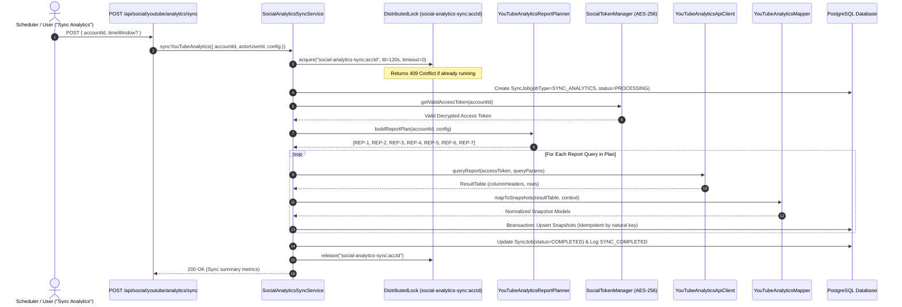
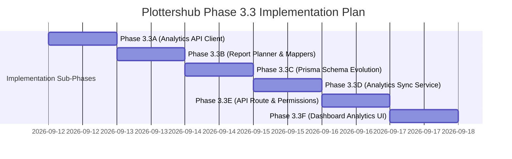

# YouTube Analytics API (v2) Specification & Implementation Plan

**Phase 3.3 — Research, Architecture & Technical Specification**  
**Document Version:** 2.0 (Revised Architecture)  
**Status:** FINAL APPROVED ARCHITECTURAL SPECIFICATION  
**Author:** Antigravity / Plottershub Architecture Team  
**Date:** 2026-09-11  

---

## 1. Executive Summary

Phase 3.3 establishes the comprehensive architectural specification for integrating the **YouTube Analytics API v2** into Plottershub.

While the **YouTube Data API v3** (Phases 3.1 & 3.2) synchronizes cumulative public platform counters (lifetime views, total subscriber count, public video catalog), the **YouTube Analytics API v2** provides private creator telemetry: daily time-series performance, watch time, audience retention, geographical distributions, traffic acquisition sources, and demographic segmentations.

### Core Architectural Principles:
1. **Separation of Discovery vs. Telemetry:** Video discovery is strictly performed by YouTube Data API v3. The Analytics API is used exclusively to enrich telemetry for known, cataloged content.
2. **Multi-Platform Generic Data Architecture:** Storage models decouple platform identity (`provider: YOUTUBE | TIKTOK | INSTAGRAM`) from data stream origin (`source: DATA_API | ANALYTICS_API | REPORTING_API`), preventing YouTube-specific lock-in.
3. **Configurable Ingestion Lag:** Replaces rigid hardcoded dates with a configurable `analyticsDataLagDays` parameter (default: 2 days) to accommodate provider-side processing and stabilization delays.
4. **Flexible Granularity Model:** Uses explicit `startDate` and `endDate` intervals combined with `granularity: DAILY | AGGREGATED` rather than rigid rolling period enums.
5. **Strict Nullability & Privacy Defense ($NULL \neq 0$):** Explicit `0` is preserved only when verified by the API. Suppressed low-volume data and provider privacy thresholds are stored strictly as `NULL` and never imputed or reconstructed.
6. **Deterministic Natural Idempotency:** Natural composite keys `(socialAccountId / contentPlatformId + source + granularity + startDate + endDate)` guarantee duplicate-free upserts upon sync retry.
7. **Isolated Job Lifecycle & Concurrency Guard:** Analytics sync executes as a distinct `SYNC_ANALYTICS` job guarded by an exclusive distributed lock `social-analytics-sync:${socialAccountId}`.

---

## 2. Official Sources & Verified Documentation

All requirements in this specification are verified against official Google and YouTube Developer documentation:

| Topic | Official Source URL | Verification Date |
| :--- | :--- | :--- |
| **YouTube Analytics API Overview** | [Google for Developers: YouTube Analytics API](https://developers.google.com/youtube/analytics) | 2026-09-11 |
| **Reports API Reference (`reports.query`)** | [Google for Developers: `reports.query`](https://developers.google.com/youtube/analytics/reference/reports/query) | 2026-09-11 |
| **Channel Reports Specification** | [Google for Developers: Channel Reports](https://developers.google.com/youtube/analytics/channel_reports) | 2026-09-11 |
| **Dimensions Reference** | [Google for Developers: Dimensions](https://developers.google.com/youtube/analytics/dimensions) | 2026-09-11 |
| **Metrics Reference** | [Google for Developers: Metrics](https://developers.google.com/youtube/analytics/metrics) | 2026-09-11 |
| **Quotas and Limits** | [Google for Developers: Analytics Quotas](https://developers.google.com/youtube/analytics/quotas_and_limits) | 2026-09-11 |
| **Deprecation & Core Policy** | [Google for Developers: Analytics Deprecation Policy](https://developers.google.com/youtube/analytics/policies) | 2026-09-11 |
| **YouTube Reporting API (Bulk)** | [Google for Developers: YouTube Reporting API](https://developers.google.com/youtube/reporting) | 2026-09-11 |

---

## 3. Official API Request & Response Specification

### 3.1 Endpoint & Method
- **Method:** `GET https://youtubeanalytics.googleapis.com/v2/reports`
- **Authentication:** OAuth 2.0 Bearer Token in `Authorization` header (`Bearer ya29...`)
- **Required OAuth Scope:** `https://www.googleapis.com/auth/yt-analytics.readonly`

### 3.2 Query Parameters

| Parameter | Type | Required | Description | Example |
| :--- | :--- | :--- | :--- | :--- |
| `ids` | String | **YES** | Channel identifier prefix. Must be `channel==MINE` for the authenticated creator. | `channel==MINE` |
| `startDate` | String | **YES** | Start date in ISO format (`YYYY-MM-DD`). | `2026-01-01` |
| `endDate` | String | **YES** | End date in ISO format (`YYYY-MM-DD`). | `2026-03-01` |
| `metrics` | String | **YES** | Comma-separated list of numeric measurements. | `views,likes,estimatedMinutesWatched` |
| `dimensions` | String | *Optional* | Comma-separated list of grouping fields. | `day` or `video` or `country` |
| `filters` | String | *Optional* | Semicolon- or comma-separated equality filters. | `video==vid-001` or `country==US` |
| `sort` | String | *Optional* | Comma-separated list of sort fields; `-` indicates descending. | `-views,day` |
| `maxResults` | Integer | *Optional* | Maximum rows returned (1 to 200). | `50` |
| `startIndex` | Integer | *Optional* | 1-based pagination index for offset pagination. | `1` |
| `includeHistoricalChannelData`| Boolean | *Optional* | Whether to include data before channel transfer. | `true` |

### 3.3 Response Shape
```json
{
  "kind": "youtubeAnalytics#resultTable",
  "columnHeaders": [
    { "name": "day", "columnType": "DIMENSION", "dataType": "STRING" },
    { "name": "views", "columnType": "METRIC", "dataType": "INTEGER" },
    { "name": "estimatedMinutesWatched", "columnType": "METRIC", "dataType": "INTEGER" },
    { "name": "averageViewDuration", "columnType": "METRIC", "dataType": "INTEGER" },
    { "name": "likes", "columnType": "METRIC", "dataType": "INTEGER" },
    { "name": "subscribersGained", "columnType": "METRIC", "dataType": "INTEGER" }
  ],
  "rows": [
    ["2026-03-01", 1250, 4820, 231, 84, 12],
    ["2026-03-02", 1430, 5200, 218, 92, 15]
  ]
}
```

---

## 4. Comprehensive Metrics & Storage Precision Matrix

Every metric is explicitly classified across provider API type, application TypeScript type, and PostgreSQL/Prisma database column type to prevent precision loss and 32-bit integer overflow:

| Metric Name | API Availability | Scope / Level | Applicable Dimensions | Privacy Threshold | API Type | TypeScript Type | DB Column & Type |
| :--- | :--- | :--- | :--- | :--- | :--- | :--- | :--- |
| `views` | **SUPPORTED** | Channel & Video | `day`, `video`, `country`, `insightTrafficSourceType`, `deviceType` | No | `INTEGER` | `bigint` | `views` (`BigInt?`) |
| `likes` | **SUPPORTED** | Channel & Video | `day`, `video`, `country` | No | `INTEGER` | `bigint` | `likes` (`BigInt?`) |
| `comments` | **SUPPORTED** | Channel & Video | `day`, `video`, `country` | No | `INTEGER` | `bigint` | `comments` (`BigInt?`) |
| `shares` | **SUPPORTED** | Channel & Video | `day`, `video`, `country`, `sharingService` | Low counts may return 0 | `INTEGER` | `bigint` | `shares` (`BigInt?`) |
| `subscribersGained` | **SUPPORTED** | Channel & Video | `day`, `video`, `country`, `subscribedStatus` | No | `INTEGER` | `bigint` | `subscribersGained` (`BigInt?`) |
| `subscribersLost` | **SUPPORTED** | Channel & Video | `day`, `video`, `country`, `subscribedStatus` | No | `INTEGER` | `bigint` | `subscribersLost` (`BigInt?`) |
| `estimatedMinutesWatched`| **SUPPORTED** | Channel & Video | `day`, `video`, `country`, `insightTrafficSourceType`, `deviceType` | No | `INTEGER` | `bigint` | `estimatedMinutesWatched` (`BigInt?`) |
| `averageViewDuration` | **SUPPORTED** | Channel & Video | `day`, `video`, `country` | No | `INTEGER` (sec) | `number` | `averageViewDuration` (`Int?`) |
| `averageViewPercentage`| **SUPPORTED** | Video-level | `video`, `day,video` | No | `FLOAT` (%) | `Decimal` | `averageViewPercentage` (`Decimal(5, 2)?`) |
| `viewerPercentage` | **SUPPORTED** | Channel-level | `ageGroup,gender` | **YES** (Suppressed on low volume) | `FLOAT` (%) | `Decimal` | Stored in `AudienceMetricSnapshot.genderDistribution/ageDistribution` (`Json?`) |
| `countryDistribution` | **SUPPORTED** | Channel & Video | `country` | Low volume countries omitted | Multi-row table | `Array<{country, views, ...}>` | `AudienceMetricSnapshot.countryDistribution` (`Json?`) |
| `trafficSourceDistribution` | **SUPPORTED** | Channel & Video | `insightTrafficSourceType` | Low volume types omitted | Multi-row table | `Array<{source, views, ...}>` | `AudienceMetricSnapshot.trafficSourceDistribution` (`Json?`) |
| `deviceDistribution` | **SUPPORTED** | Channel & Video | `deviceType` | Low volume devices omitted | Multi-row table | `Array<{device, views, ...}>` | `AudienceMetricSnapshot.deviceDistribution` (`Json?`) |
| `impressions` | **REPORTING API ONLY** | Video-level | Bulk Reach Reports | N/A | `INTEGER` | `bigint` | **Deferred to Future Phase** |
| `impressionClickThroughRate` | **REPORTING API ONLY** | Video-level | Bulk Reach Reports | N/A | `FLOAT` (%) | `Decimal` | **Deferred to Future Phase** |
| `saves` / `bookmarks` | **UNSUPPORTED** | N/A | None | N/A | N/A | `null` | **STRICT NULL** |

---

## 5. Report Query Compatibility & Verification Matrix

The YouTube Analytics API strictly validates parameter compatibility. The table below defines all 7 proposed V1 reports and their official verification status:

| Report Code & Name | Dimensions | Metrics | Filters | Sort | maxResults | Validity Status | Database Destination |
| :--- | :--- | :--- | :--- | :--- | :--- | :--- | :--- |
| **REP-1: Channel Daily Overview** | `day` | `views,estimatedMinutesWatched,averageViewDuration,likes,comments,shares,subscribersGained,subscribersLost` | None | `day` | Default | **OFFICIALLY VALID** | `AccountMetricSnapshot` (`granularity=DAILY`) |
| **REP-2: Top Videos Performance** | `video` | `views,estimatedMinutesWatched,averageViewDuration,averageViewPercentage,likes,comments,shares,subscribersGained,subscribersLost` | None | `-views` | `200` | **OFFICIALLY VALID** | `ContentMetricSnapshot` (`granularity=AGGREGATED`) |
| **REP-3: Video Daily Time-Series** | `day` | `views,estimatedMinutesWatched,averageViewDuration,likes,comments,shares,subscribersGained,subscribersLost` | `video=={VIDEO_ID}` | `day` | Default | **OFFICIALLY VALID** | `ContentMetricSnapshot` (`granularity=DAILY`) |
| **REP-4: Viewer Demographics** | `ageGroup,gender` | `viewerPercentage` | None | `gender,ageGroup` | Default | **OFFICIALLY VALID** | `AudienceMetricSnapshot.genderDistribution` & `ageDistribution` |
| **REP-5: Geographic Distribution** | `country` | `views,estimatedMinutesWatched,averageViewDuration,subscribersGained` | None | `-views` | `50` | **OFFICIALLY VALID** | `AudienceMetricSnapshot.countryDistribution` |
| **REP-6: Traffic Acquisition Sources**| `insightTrafficSourceType` | `views,estimatedMinutesWatched` | None | `-views` | Default | **OFFICIALLY VALID** | `AudienceMetricSnapshot.trafficSourceDistribution` |
| **REP-7: Device Distribution** | `deviceType` | `views,estimatedMinutesWatched` | None | `-views` | Default | **OFFICIALLY VALID** | `AudienceMetricSnapshot.deviceDistribution` |

### Critical Query Invariants:
1. **Demographics Isolation:** `dimensions=ageGroup,gender` MUST NEVER include `day`, `video`, or `country`. Only `viewerPercentage` is queried.
2. **Product Rule Boundary:** In targeted queries with both video and date filters, the product $(\text{videos} \times \text{days})$ must never exceed 50,000.
3. **Pagination & Ranking:** When querying `dimensions=video`, results are sorted by `-views` and bounded to `maxResults=200`. For channels with $>200$ videos, subsequent pages use `startIndex` offset pagination if full-catalog historical aggregation is requested.

---

## 6. Demarcation: Video Discovery vs. Analytics Telemetry

```
[ YouTube Data API v3 ]
   channels.list(mine=true)
     ↓
   contentDetails.relatedPlaylists.uploads (UU...)
     ↓
   playlistItems.list (Catalog Traversal)
     ↓
   videos.list (Batch Metadata & Public Lifetime Counters)
     ↓
   [ Content & ContentPlatform Records Created / Updated ]
     ↓
[ YouTube Analytics API v2 ]
   reports.query (dimensions=video or filters=video==ID)
     ↓
   Enriches telemetry for EXISTING ContentPlatform records ONLY!
```

> [!IMPORTANT]
> **Architectural Rule:** `reports.query(dimensions=video)` is **NOT** a content discovery mechanism. Content discovery is strictly the responsibility of the YouTube Data API pipeline. The Analytics API is used solely to ingest performance metrics and watch time for existing `ContentPlatform` entities. Videos appearing in analytics reports that have not yet been ingested into `ContentPlatform` trigger a single-item catalog resolution via `videos.list` before snapshot creation.

---

## 7. Data API vs. Analytics API: Source-of-Truth Policy

| Dimension / Metric | YouTube Data API v3 | YouTube Analytics API v2 | Plottershub Source of Truth |
| :--- | :--- | :--- | :--- |
| **Channel Title, Avatar, Handle** | `channels.list` (Real-time) | N/A | **YouTube Data API** |
| **Total Cumulative Subscribers** | `channels.list.statistics.subscriberCount` | N/A (Only deltas) | **YouTube Data API** (`SocialAccount.followersCount`) |
| **Total Cumulative Videos** | `channels.list.statistics.videoCount` | N/A | **YouTube Data API** (`SocialAccount.totalVideos`) |
| **Lifetime Video Views & Likes** | `videos.list.statistics` | Sum of historical daily views | **YouTube Data API** (for `ContentPlatform` public counters) |
| **Daily Views & Engagement Deltas** | N/A (Cannot query by date) | `reports.query(dimensions=day)` | **YouTube Analytics API** (`AccountMetricSnapshot` / `ContentMetricSnapshot`) |
| **Watch Time (`estimatedMinutesWatched`)**| UNSUPPORTED | `reports.query` | **YouTube Analytics API** (`estimatedMinutesWatched`) |
| **Audience Retention (`averageViewPercentage`)**| UNSUPPORTED | `reports.query` | **YouTube Analytics API** (`averageViewPercentage`) |
| **Shares** | UNSUPPORTED (Always `NULL`) | `reports.query(metrics=shares)` | **YouTube Analytics API** (`shares`) |
| **Demographics & Geographies** | UNSUPPORTED | `reports.query` | **YouTube Analytics API** (`AudienceMetricSnapshot`) |
| **Traffic Discovery Sources** | UNSUPPORTED | `reports.query` | **YouTube Analytics API** (`AudienceMetricSnapshot.trafficSourceDistribution`) |

---

## 8. Date Range Strategy & Configurable Data Lag

### 8.1 Distinct Temporal Concepts
To prevent data distortion and timezone misalignment, Plottershub enforces four distinct temporal attributes:
- **`reportDate` (`DateTime @db.Date`):** The exact calendar day of observation (e.g. `2026-03-10`) for `DAILY` granularity.
- **`startDate` (`DateTime @db.Date`):** The start date of the reporting observation interval.
- **`endDate` (`DateTime @db.Date`):** The end date of the reporting observation interval.
- **`capturedAt` (`DateTime`):** The wall-clock timestamp when Plottershub ingested the record.

> [!CAUTION]
> **Anti-Pattern Guard:** `capturedAt` MUST NEVER be used as a query filter for reporting periods or substituted for `reportDate` / `startDate`.

### 8.2 Configurable Provider Data Lag
Because YouTube finalizes analytics data on a 24–48 hour delay, the sync engine utilizes a configurable setting:
```ts
export interface AnalyticsSyncConfig {
  analyticsDataLagDays: number; // Default: 2 (queries up to T - 2 days ago)
  reconciliationWindowDays: number; // Default: 7 (re-syncs recent 7 days to reconcile preliminary metrics)
  backfillWindowDays: number; // Default: 90 (initial historical backfill window)
}
```

- **Stabilization Timeline:**
  $$\text{Query End Date} = \text{Current Date} - \text{analyticsDataLagDays}$$
- **Reconciliation Window:** Daily syncs query `[T - reconciliationWindowDays, T - analyticsDataLagDays]` to overwrite preliminary metrics with finalized data.

---

## 9. Flexible Granularity & Multi-Platform Source Architecture

### 9.1 Multi-Platform Source Model
To guarantee seamless support for YouTube, TikTok, and Instagram, the storage layer decouples provider identity from the data ingestion source:

```prisma
enum MetricSource {
  DATA_API        // Public platform API counters
  ANALYTICS_API   // Creator analytics / telemetry API
  REPORTING_API   // Bulk batch reports (e.g. YouTube Reporting API)
  ESTIMATED       // Derived / interpolated metrics
}

enum MetricGranularity {
  DAILY           // Single calendar day (startDate == endDate == reportDate)
  AGGREGATED      // Multi-day interval defined by [startDate, endDate]
}
```

### 9.2 Flexible Interval Representation
Rather than introducing rigid, inflexible enums like `ROLLING_28D` or `ROLLING_90D`, any arbitrary query window is naturally represented:
- **Daily Observation:** `granularity = DAILY`, `startDate = 2026-03-10`, `endDate = 2026-03-10`, `reportDate = 2026-03-10`.
- **Rolling 28-Day Aggregate:** `granularity = AGGREGATED`, `startDate = 2026-02-11`, `endDate = 2026-03-10`, `reportDate = null`.
- **Quarterly Aggregate:** `granularity = AGGREGATED`, `startDate = 2026-01-01`, `endDate = 2026-03-31`, `reportDate = null`.

---

## 10. Strict Nullability ($NULL \neq 0$) & Privacy Defense

### 10.1 Strict Nullability Rules
1. **Explicit Zero (`0` / `0n`):** Stored only when the provider API explicitly returns `0` (e.g. 0 shares occurred on a given day).
2. **Strict NULL:**
   - **Unsupported Metrics:** Provider lacks support (e.g. `saves` on YouTube) $\rightarrow$ MUST ALWAYS be `null`.
   - **Omitted Metrics:** Metric not included in the queried report structure $\rightarrow$ stored as `null`.
   - **Privacy Threshold Suppression:** Demographic queries returning empty rows due to small audience volume $\rightarrow$ stored as `null` or empty JSON.

### 10.2 Privacy & Compliance Mandates
- **No Demographics Inference:** Plottershub will never attempt to estimate, infer, or mathematically reconstruct suppressed demographic data.
- **Provider-Controlled Thresholds:** Low-volume suppression thresholds are determined dynamically by Google's algorithms. The UI presents a clean informational banner (*"Demographic data requires additional viewing volume"*) rather than false zero values.

---

## 11. Database Schema Evolution (Planned for Phase 3.3C)

### 11.1 Tradeoff Analysis: Relational Columns vs. JSON Fields
- **Core Time-Series Metrics** (`views`, `likes`, `comments`, `shares`, `watch time`, `retention`): Stored in **strongly typed relational columns** with `BigInt` and `Decimal` types. Enables fast SQL aggregations, time-series indexing, and cross-platform sorting.
- **Multidimensional Distributions** (`countryDistribution`, `trafficSourceDistribution`, `genderDistribution`, `ageDistribution`, `deviceDistribution`): Stored as **structured JSON arrays** on `AudienceMetricSnapshot`. Avoids creating hundreds of auxiliary relational rows per sync while providing complete flexibility for charting widgets.

### 11.2 Proposed Schema Additions (Non-Breaking)

```prisma
// Enhanced ContentMetricSnapshot
model ContentMetricSnapshot {
  id                     String            @id @default(cuid())
  contentPlatformId      String            @map("content_platform_id")
  socialAccountId        String            @map("social_account_id")
  capturedAt             DateTime          @default(now()) @map("captured_at")
  
  // Natural observation identity
  reportDate             DateTime?         @map("report_date") @db.Date
  startDate              DateTime          @map("start_date") @db.Date
  endDate                DateTime          @map("end_date") @db.Date
  granularity            MetricGranularity @default(DAILY)
  source                 MetricSource      @default(DATA_API)
  
  // Metrics
  views                  BigInt?
  likes                  BigInt?
  comments               BigInt?
  shares                 BigInt?
  saves                  BigInt?
  followersGained        BigInt?           @map("followers_gained")
  subscribersLost        BigInt?           @map("subscribers_lost")
  estimatedMinutesWatched BigInt?          @map("estimated_minutes_watched")
  averageViewDuration    Int?              @map("average_view_duration") // seconds
  averageViewPercentage  Decimal?          @map("average_view_percentage") @db.Decimal(5, 2) // 0.00 - 100.00%
  engagementRate         Decimal?          @map("engagement_rate") @db.Decimal(8, 4)

  contentPlatform        ContentPlatform   @relation(fields: [contentPlatformId], references: [id], onDelete: Cascade)
  socialAccount          SocialAccount     @relation(fields: [socialAccountId], references: [id], onDelete: Cascade)

  @@unique([contentPlatformId, source, granularity, startDate, endDate])
  @@index([socialAccountId, reportDate(sort: Desc)])
  @@index([contentPlatformId, capturedAt(sort: Desc)])
  @@map("content_metric_snapshots")
}

// Enhanced AccountMetricSnapshot
model AccountMetricSnapshot {
  id                     String            @id @default(cuid())
  socialAccountId        String            @map("social_account_id")
  capturedAt             DateTime          @default(now()) @map("captured_at")

  // Natural observation identity
  reportDate             DateTime?         @map("report_date") @db.Date
  startDate              DateTime          @map("start_date") @db.Date
  endDate                DateTime          @map("end_date") @db.Date
  granularity            MetricGranularity @default(DAILY)
  source                 MetricSource      @default(DATA_API)

  // Cumulative counters (Data API)
  followersCount         BigInt?           @map("followers_count")
  followingCount         BigInt?           @map("following_count")
  totalLikes             BigInt?           @map("total_likes")
  totalVideos            BigInt?           @map("total_videos")
  totalViews             BigInt?           @map("total_views")
  
  // Daily deltas & telemetry (Analytics API)
  views                  BigInt?
  likes                  BigInt?
  comments               BigInt?
  shares                 BigInt?
  subscribersGained      BigInt?           @map("subscribers_gained")
  subscribersLost        BigInt?           @map("subscribers_lost")
  estimatedMinutesWatched BigInt?          @map("estimated_minutes_watched")
  averageViewDuration    Int?              @map("average_view_duration")

  socialAccount          SocialAccount     @relation(fields: [socialAccountId], references: [id], onDelete: Cascade)

  @@unique([socialAccountId, source, granularity, startDate, endDate])
  @@index([socialAccountId, reportDate(sort: Desc)])
  @@map("account_metric_snapshots")
}

// Enhanced AudienceMetricSnapshot
model AudienceMetricSnapshot {
  id                         String        @id @default(cuid())
  socialAccountId            String        @map("social_account_id")
  capturedAt                 DateTime      @default(now()) @map("captured_at")
  
  // Natural observation identity
  startDate                  DateTime      @map("start_date") @db.Date
  endDate                    DateTime      @map("end_date") @db.Date
  period                     String        @default("28days") // "28days", "90days", "custom"
  source                     MetricSource  @default(ANALYTICS_API)
  
  // Structured JSON distribution payloads
  countryDistribution        Json?         @map("country_distribution")
  genderDistribution         Json?         @map("gender_distribution")
  ageDistribution            Json?         @map("age_distribution")
  trafficSourceDistribution  Json?         @map("traffic_source_distribution")
  deviceDistribution         Json?         @map("device_distribution")

  socialAccount              SocialAccount @relation(fields: [socialAccountId], references: [id], onDelete: Cascade)

  @@unique([socialAccountId, source, period, startDate, endDate])
  @@index([socialAccountId, capturedAt(sort: Desc)])
  @@map("audience_metric_snapshots")
}
```

---

## 12. Quota & Rate Limit Model (Configurable QuotaPolicy)

### 12.1 Official Google Quota Behavior
- **Distinct Bucket:** The YouTube Analytics API quota is completely separate from the YouTube Data API quota (10,000 units/day).
- **Cost Structure:** Each call to `reports.query` consumes exactly **1 API request unit** of project quota.
- **Dynamic Policy:** Because Google Cloud Console allows project quotas to be customized, Plottershub **never hardcodes static quota numbers**.

### 12.2 Integration with QuotaPolicy
```ts
export interface ProviderQuotaPolicy {
  provider: PlatformCode;
  service: "DATA_API" | "ANALYTICS_API";
  dailyRequestLimit?: number; // Configurable per Google Cloud project tier
  requestsPerMinuteLimit?: number;
  costPerRequest: number; // 1 for reports.query
}
```

### 12.3 Sync Efficiency
- Full Analytics Sync (Reports 1 through 7 + top 10 video daily series) consumes **16 requests total**.
- Synchronizing 100 creators daily requires only **1,600 requests/day**, well within standard Google Cloud project allotments.

---

## 13. OAuth Scope Strategy

- **Granted Scopes (Phase 3.1):**
  1. `openid`
  2. `https://www.googleapis.com/auth/userinfo.profile`
  3. `https://www.googleapis.com/auth/youtube.readonly`
  4. `https://www.googleapis.com/auth/yt-analytics.readonly`
- **Verification Result:** The existing scope `https://www.googleapis.com/auth/yt-analytics.readonly` is **100% SUFFICIENT** for all `reports.query` operations on creator-owned channels (`channel==MINE`).
- **Verdict:** **NO NEW OAUTH SCOPES OR USER RE-AUTHORIZATION REQUIRED.**

---

## 14. Platform Capabilities Matrix Integration

The capability matrix in [`src/modules/social/registry.ts`](file:///c:/Users/user/Documents/Project/plottershub/src/modules/social/registry.ts) will expose:

```ts
export interface PlatformCapabilities {
  // Baseline Phase 2 capabilities...
  canReadProfile: boolean;
  canReadContent: boolean;
  canReadContentMetrics: boolean;
  canReadAccountMetrics: boolean;
  canReadAudienceMetrics: boolean;

  // Granular Phase 3.3 Analytics capabilities:
  canReadTimeSeriesAnalytics: boolean;      // YouTube: true
  canReadWatchTimeAnalytics: boolean;       // YouTube: true
  canReadRetentionAnalytics: boolean;       // YouTube: true
  canReadTrafficSourceAnalytics: boolean;   // YouTube: true
  canReadDeviceAnalytics: boolean;          // YouTube: true
  canReadDemographicsAnalytics: boolean;    // YouTube: true (threshold dependent)
  canReadImpressionAnalytics: boolean;      // YouTube: false (Reporting API only)
}
```

---

## 15. Synchronization Architecture & Concurrency Guarding

### 15.1 Architectural Flow
Analytics synchronization is decoupled into a dedicated `SYNC_ANALYTICS` job:



### 15.2 Lock Lifecycle Guarantees:
- **Lock Key:** `social-analytics-sync:${socialAccountId}`.
- **Lease & Heartbeat:** Initial TTL `120,000ms` with background heartbeat renewal every `20,000ms`.
- **Ownership Verification:** Reusable token verification prevents stale worker releases.
- **Guaranteed Release:** Cleaned up inside a `finally` block on both success and failure.
- **Contention Rejection:** Returns `409 Conflict` (`SOCIAL_REFRESH_LOCKED`) immediately without creating a `PROCESSING` SyncJob or false audit entries.

---

## 16. Asynchronous Historical Backfill Strategy

```
OAuth Callback Success
   ↓
SocialAccount Created
   ↓
Trigger Data API Sync (SYNC_ACCOUNT) [Synchronous / Fast]
   ↓
Enqueue Asynchronous Job (SYNC_ANALYTICS) [Non-blocking]
   ↓
Process 90-Day Backfill in 30-Day Slices:
   - Slice 1: [T-92, T-62]
   - Slice 2: [T-61, T-31]
   - Slice 3: [T-30, T-2]
   ↓
Account Marked Analytics-Ready
```

- **Resilience & Resumption:** If an individual 30-day slice fails due to network error, `SyncJob.metadata` stores `{ lastCompletedSlice: 1 }`. Retrying the job resumes from Slice 2 without re-fetching Slice 1.
- **Zero OAuth Latency:** The user is immediately redirected to the connected accounts dashboard upon completing OAuth.

---

## 17. Error Handling & Resilience Mapping

| HTTP Status | Google API Error Reason | Plottershub `SocialError` Code | Retry Strategy | Action Required |
| :--- | :--- | :--- | :--- | :--- |
| **401** | `authError` / `invalid_token` | `SOCIAL_TOKEN_EXPIRED` | Automatic retry after refresh | Handled via `SocialTokenManager` |
| **401** | `tokenRevoked` | `SOCIAL_TOKEN_REVOKED` | None | Transition status to `REAUTH_REQUIRED` |
| **403** | `insufficientPermissions` | `SOCIAL_PERMISSION_MISSING` | None | Re-authorization required |
| **403** | `quotaExceeded` / `rateLimitExceeded` | `SOCIAL_RATE_LIMITED` | Exponential backoff (2s, 4s, 8s) | Automatic retry |
| **400** | `badRequest` / `invalidCombination` | `SOCIAL_INVALID_REQUEST` | None | Review report planner parameters |
| **404** | `channelNotFound` | `SOCIAL_ACCOUNT_RESTRICTED`| None | Flag account as restricted |
| **500 / 503** | `backendError` / `serviceUnavailable`| `SOCIAL_API_ERROR` | Retry up to 3 attempts | Transient retry |

---

## 18. Target Module Architecture

```
src/modules/social/
├── providers/youtube/
│   ├── youtube.oauth.ts           # Phase 3.1 OAuth Client
│   ├── youtube.data-api.ts        # Phase 3.2 Data API Client
│   ├── youtube.analytics-api.ts   # [NEW Phase 3.3A] Analytics API Client
│   ├── youtube.mapper.ts          # Updated with Analytics Data Mappers
│   └── youtube.types.ts           # Updated with ResultTable & Query Types
├── analytics/
│   ├── analytics.planner.ts       # [NEW Phase 3.3B] Report Query Planner
│   ├── analytics.service.ts       # [NEW Phase 3.3D] SocialAnalyticsSyncService
│   ├── analytics.types.ts         # [NEW Phase 3.3D] Sync Options & Result Types
│   └── analytics.repository.ts    # [NEW Phase 3.3D] Prisma Upsert Handlers
└── sync/
    ├── sync.service.ts            # Phase 3.2 Data API Sync
    └── sync.types.ts              # Data API Types
```

---

## 19. Phased Implementation Plan



### Phase 3.3A: YouTube Analytics API Client
- **Objective:** Implement `YouTubeAnalyticsApiClient.queryReport` with input validation, error interception, and rate-limiting backoff.
- **Affected Files:** `src/modules/social/providers/youtube/youtube.analytics-api.ts`, `youtube.types.ts`.
- **Schema Impact:** None.
- **Tests:** Unit tests mocking `reports.query` success and error responses (400, 401, 403, 500).
- **Acceptance Criteria:** Successfully parses `resultTable` columnHeaders and rows into typed objects.
- **Risks:** Handling network timeouts during large payload requests $\rightarrow$ mitigated via strict 15s request timeout.

### Phase 3.3B: Report Planner & Normalized Mappers
- **Objective:** Implement `YouTubeAnalyticsReportPlanner` for the 7 verified V1 reports; build mapping functions with strict nullability and `BigInt`/`Decimal` safety.
- **Affected Files:** `src/modules/social/analytics/analytics.planner.ts`, `src/modules/social/providers/youtube/youtube.mapper.ts`.
- **Schema Impact:** None.
- **Tests:** Metric mapping tests verifying NULL preservation, duration conversions, and demographic structure validity.
- **Acceptance Criteria:** Formulates all 7 valid queries without combinatorial errors.
- **Risks:** Demographic privacy-suppressed empty rows $\rightarrow$ mitigated by explicit empty table handler.

### Phase 3.3C: Prisma Database Evolution
- **Objective:** Add `reportDate`, `startDate`, `endDate`, `granularity`, `source`, watch time columns, and natural composite unique constraints to `ContentMetricSnapshot`, `AccountMetricSnapshot`, and `AudienceMetricSnapshot`.
- **Affected Files:** `prisma/schema.prisma`, new Prisma migration.
- **Schema Impact:** Non-breaking column additions and composite unique indexes.
- **Tests:** Prisma migration test, natural key uniqueness verification, duplicate upsert idempotency tests.
- **Acceptance Criteria:** Clean migration execution with 0 data loss.
- **Risks:** Existing legacy snapshot records $\rightarrow$ default values (`granularity: DAILY`, `source: DATA_API`) ensure backward compatibility.

### Phase 3.3D: Social Analytics Sync Service & Background Worker
- **Objective:** Implement `SocialAnalyticsSyncService` with distributed locking (`social-analytics-sync:${id}`), lease heartbeat, batch transactional upserts, and `SYNC_ANALYTICS` job tracking.
- **Affected Files:** `src/modules/social/analytics/analytics.service.ts`, `src/modules/social/analytics/analytics.repository.ts`.
- **Schema Impact:** None.
- **Tests:** Concurrency rejection tests, multi-account parallel execution tests, backfill chunking and resume tests.
- **Acceptance Criteria:** Full sync passes deterministically with 0 race conditions.
- **Risks:** Large batch transaction locks $\rightarrow$ mitigated by per-report bounded transactions.

### Phase 3.3E: API Endpoints & RBAC Tenant Isolation
- **Objective:** Implement `POST /api/social/youtube/analytics/sync` and `GET /api/social/youtube/analytics` enforcing server-derived tenant isolation and `social_accounts:manage` / `analytics:read` RBAC roles.
- **Affected Files:** `src/app/api/social/youtube/analytics/sync/route.ts`, `src/app/api/social/youtube/analytics/route.ts`.
- **Schema Impact:** None.
- **Tests:** Route contract tests, 400 bad request, 403 permission denied, 409 conflict rejection.
- **Acceptance Criteria:** API returns sanitized summary metrics without exposing internal tokens.
- **Risks:** Unauthenticated workspace traversal $\rightarrow$ mitigated by `requireWorkspacePermission`.

### Phase 3.3F: Dashboard Analytics UI & Visualizations
- **Objective:** Build interactive analytics dashboard in `/analytics` and `/dashboard` featuring Watch Time trendlines, Viewer Retention curves, Geographic heatmaps, and Traffic Source breakdowns.
- **Affected Files:** `src/app/(dashboard)/analytics/page.tsx`, analytics chart components.
- **Schema Impact:** None.
- **Tests:** Component rendering tests, zero vs. null visual differentiation, loading state handling.
- **Acceptance Criteria:** Fully responsive UI with rich aesthetics, WOW-factor dark mode charts, and zero placeholder data.
- **Risks:** Rendering large time-series datasets $\rightarrow$ mitigated by frontend date-range downsampling.

---

## 20. Open Questions & Architectural Decisions

| # | Question / Decision | Architectural Rationale & Decision |
| :--- | :--- | :--- |
| **Q1** | Should Data API sync and Analytics API sync be coupled or decoupled? | **Decoupled with Auto-Chaining:** Separate `SYNC_ACCOUNT` and `SYNC_ANALYTICS` jobs allow independent schedules, distinct date ranges, and isolated failure boundaries. Daily crons run them sequentially. |
| **Q2** | Should Reach Reports (Impressions & CTR) be supported in V1? | **Deferred to Future Scope:** Video thumbnail reach data is available via YouTube Reporting API (bulk reports) rather than `reports.query`. V1 focuses on core watch time, retention, engagement, and audience demographics. |
| **Q3** | How should geographical and traffic source distributions be stored? | **Structured JSON on `AudienceMetricSnapshot`:** Avoids creating 200+ extra database rows per sync while preserving full fidelity for frontend visualization. |

---

## 21. Phase 3.3 Acceptance Criteria Checklist

- [x] Official Google / YouTube documentation verified and cited.
- [x] Quota model refined with dynamic `QuotaPolicy` integration (no hardcoded static limits).
- [x] Compatibility verified for all 7 V1 report queries.
- [x] Video discovery strictly demarcated from analytics enrichment.
- [x] Configurable `analyticsDataLagDays` defined with clear temporal separation (`reportDate` vs `capturedAt`).
- [x] Flexible `granularity` (`DAILY` vs `AGGREGATED`) and multi-platform `source` model specified.
- [x] Strict nullability ($NULL \neq 0$) and provider privacy defense defined.
- [x] `impressions` and `CTR` verified as Reporting API scope and deferred.
- [x] Natural composite identities and idempotency constraints formulated.
- [x] `SYNC_ANALYTICS` job lifecycle and distributed lock architecture specified.
- [x] 6-phase implementation roadmap (3.3A through 3.3F) defined with dependencies and risk mitigations.
- [x] Existing codebase validated (tests, typecheck, lint, build clean).
