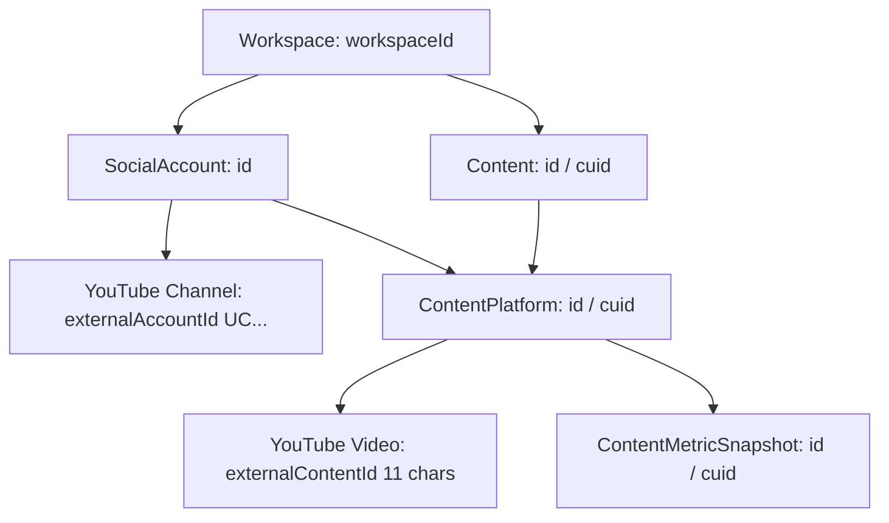
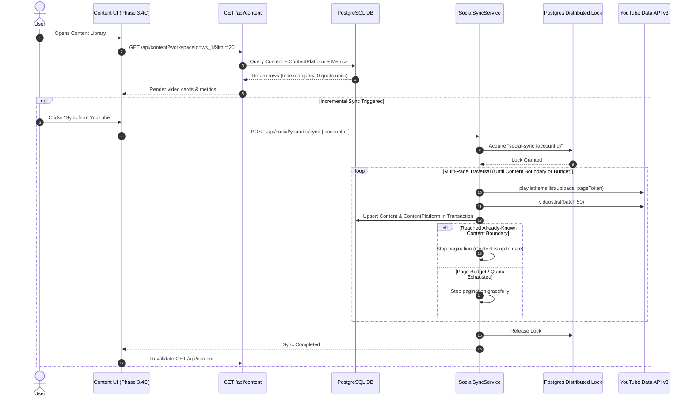

# YouTube Content Read Pipeline Specification & Architecture Blueprint

**Project:** Plottershub  
**Phase:** 3.4C — YouTube Content Read Pipeline (Research & Implementation Planning Only)  
**Status:** Approved Architectural Specification (Revision 2 — Research & Design Only)  
**Date:** 2026-09-19  
**Target Provider:** YouTube Data API v3 (`channels.list`, `playlistItems.list`, `videos.list`)  
**Design System Direction:** Light Professional Analytics (White cards, light gray canvas, subtle borders, 6px radii, dense layouts)  

---

## 1. Executive Summary

Phase 3.4C transitions Plottershub from an analytics-only workspace into an operational **YouTube Content Management Workspace**. It establishes the architecture to read, index, filter, search, and present the user's YouTube video inventory with high reliability, strict multi-tenant isolation, and minimal quota consumption.

### Core Architecture Highlights
1. **Quota-Efficient Ingestion Architecture**: Traverses the channel's authenticated **Uploads Playlist** (`channels.list` $\rightarrow$ `UU...` playlist $\rightarrow$ `playlistItems.list` $\rightarrow$ batched `videos.list`). Compared to `search.list` (100 units per request under current YouTube quota policy), retrieving 50 videos via `playlistItems.list` (1 unit) and `videos.list` (1 unit) consumes 2 units—a 50x quota efficiency gain under identical 50-item request assumptions.
2. **Sync-Backed Serving Model**: Content is synced into local database entities (`Content`, `ContentPlatform`, and `ContentMetricSnapshot`) and served to the UI using indexed SQL queries, full-text substring filtering, bounded pagination, and zero external API quota overhead during user navigation.
3. **Rigorous Multi-Signal Shorts Classification**: Replaces simplistic duration-only rules with a multi-signal classification model that accounts for upload date boundaries (October 15, 2024 platform rule expansion to 3 minutes), available orientation signals, and an explicit **`UNKNOWN`** fallback when API data is insufficient. Uncertain videos are never silently classified as `SHORTS` or `LONG_FORM`.
4. **Light Professional Analytics UI**: Integrates with the Phase 3.4B visual design system (pure white cards, subtle 1px borders, restrained `shadow-sm`, 36px table row density, and responsive card-list fallbacks on mobile viewports).
5. **Publishing Intelligence Guardrails**: Preserves exact ISO 8601 publication timestamps, channel timezone metadata, and granular metric snapshots to power future Day 1 / Day 2 / Day 3 cumulative velocity calculations (Phase 3.4G) without fabricating audience activity or concurrent viewer data.

---

## 2. Current Architecture Audit

A thorough audit of the existing Plottershub codebase reveals high-quality foundational primitives that can be reused directly without code duplication:

| Component | File Path | Current Capabilities | Reusability in Phase 3.4C |
| :--- | :--- | :--- | :--- |
| **YouTube Data API Client** | `src/modules/social/providers/youtube/youtube.data-api.ts` | Implements `getAuthenticatedChannel`, `getUploadsPlaylistItems`, and `getVideosBatch`. Handles batches of up to 50 IDs. | **100% Reusable**. Core API driver for Content Read. |
| **YouTube Provider** | `src/modules/social/providers/youtube/youtube.provider.ts` | Implements `listContent()` and `getContentMetrics()`. Integrates OAuth and mappers. | **100% Reusable**. Exposes normalized provider contract. |
| **YouTube Mapper** | `src/modules/social/providers/youtube/youtube.mapper.ts` | Parses ISO 8601 durations (`PT15M33S`), converts string numbers to `BigInt \| null` (`NULL != 0`), maps channels and videos. | **Reusable Baseline**. Enhance with multi-signal classification. |
| **SocialTokenManager** | `src/modules/social/token-manager.ts` | Manages AES-256-GCM encrypted tokens, 5-minute pre-emptive refresh buffer, handles `invalid_grant` revocations. | **100% Reusable**. Transparent access token lifecycle. |
| **Distributed Lock** | `src/lib/lock/distributed-lock.ts` | Atomic distributed locking with heartbeat extensions to prevent concurrent sync races per account. | **100% Reusable**. Ensures single-worker sync integrity. |
| **Sync Service** | `src/modules/social/sync/sync.service.ts` | Orchestrates channel and video syncs, updates `SocialAccount.status`, creates `SyncJob` records, logs audit events. | **Reusable Baseline**. Extend with multi-page content boundary detection. |
| **RBAC Framework** | `src/lib/auth/rbac.ts` | Role-based permission matrix (`content:view`, `content:create`, `social_accounts:manage`). | **100% Reusable**. Enforces authorization boundaries. |
| **Content Page UI** | `src/app/(dashboard)/content/page.tsx` | Static placeholder card. | **Target for Phase 3.4C UI Replacement**. |

---

## 3. Official YouTube API Research

### Official YouTube Data API v3 Endpoints & Quota Reference

All endpoints, parts, and quota costs are documented according to current official Google YouTube Data API v3 documentation. Quota costs are tracked via the system's configurable `QuotaPolicy` and are not treated as permanent immutable constants:

```
1. channels.list (mine=true)
   Current Quota: 1 unit per request
   Parts: snippet,contentDetails,statistics,status
   Role: Channel identity, statistics, uploads playlist discovery

2. playlistItems.list (playlistId="UU...")
   Current Quota: 1 unit per request (maxResults=50)
   Parts: snippet,contentDetails,status
   Role: Reverse-chronological video ID discovery without expensive search

3. videos.list (id="id1,id2,...,id50")
   Current Quota: 1 unit per request (batch of up to 50 video IDs)
   Parts: snippet,contentDetails,status,statistics,liveStreamingDetails
   Role: Metadata, privacy status, duration, categories, tags, and public metrics
```

#### Detailed Part & Field Matrix

| API Endpoint | Required Parts | Key Fields Extracted | Current Quota Cost | Notes & Constraints |
| :--- | :--- | :--- | :--- | :--- |
| `GET /channels` | `snippet,contentDetails,statistics,status` | `id` (UC...), `snippet.title`, `snippet.customUrl`, `snippet.thumbnails`, `contentDetails.relatedPlaylists.uploads` (UU...), `statistics.videoCount` | **1 unit** | Called during account connect or re-authenticated sync. Uploads playlist ID is cached in `SocialAccount.rawMetadata`. |
| `GET /playlistItems` | `snippet,contentDetails,status` | `contentDetails.videoId`, `contentDetails.videoPublishedAt`, `snippet.publishedAt`, `snippet.title`, `snippet.description`, `snippet.thumbnails`, `status.privacyStatus` | **1 unit** | Paginates up to 50 items using `pageToken`. Contains videos in reverse-chronological order. |
| `GET /videos` | `snippet,contentDetails,status,statistics,liveStreamingDetails` | • **Snippet**: `title`, `description`, `publishedAt`, `thumbnails`, `channelId`, `channelTitle`, `tags`, `categoryId`, `liveBroadcastContent`<br>• **ContentDetails**: `duration` (ISO 8601), `dimension`, `definition`, `caption`, `licensedContent`<br>• **Status**: `uploadStatus`, `privacyStatus`, `license`, `embeddable`, `madeForKids`, `publishAt`<br>• **Statistics**: `viewCount`, `likeCount`, `commentCount`<br>• **LiveStreaming**: `scheduledStartTime`, `actualStartTime`, `concurrentViewers` | **1 unit** (per batch of up to 50 video IDs) | Batched by comma-separated `id` list. Note: `dislikeCount` is deprecated and hidden by YouTube API. |

#### Why `search.list` is Excluded from Content Read
- **Quota Consumption**: `search.list` currently costs **100 units** per request. Traversal via `playlistItems.list` (1 unit) + `videos.list` (1 unit) costs **2 units** per 50 videos under current documented quotas.
- **Incomplete Metadata**: `search.list` returns partial snippets with missing statistics, missing duration, and missing privacy flags, requiring a secondary `videos.list` call regardless.
- **Visibility Discrepancies**: `search.list` may omit newly uploaded or unlisted videos that are readily accessible through the channel's authenticated uploads playlist.

---

## 4. Content Identity

To prevent entity collision, preserve workspace boundaries, and ensure clean multi-platform extensibility, Plottershub enforces a strict multi-tier identity model:



### Identity Definitions
1. **Workspace ID (`workspaceId`)**: The multi-tenant boundary. Every SQL query, API route, and repository method MUST filter by `workspaceId`. No cross-workspace visibility is permitted.
2. **SocialAccount ID (`socialAccountId`)**: The internal cuid representing a connected YouTube channel within a specific workspace.
3. **YouTube Channel ID (`externalAccountId`)**: The official YouTube Channel ID (format: `UC...`). **Google email address is NEVER used as content or account identity** because a single Google login may own multiple Brand Channels.
4. **Internal Content ID (`contentId`)**: The platform-agnostic root entity in Plottershub representing a creative work (allows linking a single video to both a YouTube upload and future TikTok/Instagram adaptations).
5. **ContentPlatform ID (`contentPlatformId`)**: The relational junction between `Content` and `SocialAccount`. Maps the specific platform publication instance.
6. **YouTube Video ID (`externalContentId`)**: The canonical 11-character YouTube video ID (e.g., `dQw4w9WgXcQ`). Within a given `SocialAccount`, `externalContentId` is unique (`@@unique([socialAccountId, externalContentId])`).

---

## 5. Content Data Model

### Relational Schema Mapping

```
┌──────────────────────────────────────┐
│               Content                │
├──────────────────────────────────────┤
│ id: String (cuid)                    │
│ workspaceId: String                  │
│ title: String                        │
│ description: String? (Text)          │
│ caption: String? (Text)              │
│ status: ContentStatus                │
│ publishedAt: DateTime?               │
│ createdAt: DateTime                  │
│ updatedAt: DateTime                  │
└──────────────────┬───────────────────┘
                   │ 1
                   │
                   │ *
┌──────────────────▼───────────────────┐       ┌──────────────────────────────────────┐
│           ContentPlatform            │       │            SocialAccount             │
├──────────────────────────────────────┤       ├──────────────────────────────────────┤
│ id: String (cuid)                    │       │ id: String (cuid)                    │
│ contentId: String                    │       │ workspaceId: String                  │
│ socialAccountId: String              ├───────► platformId: String                   │
│ externalContentId: String? (Video ID)│       │ externalAccountId: String (UC...)    │
│ externalUrl: String?                 │       │ username: String                     │
│ status: ContentPlatformStatus        │       │ displayName: String?                 │
│ scheduledAt: DateTime?               │       │ avatarUrl: String?                   │
│ publishedAt: DateTime?               │       │ status: SocialAccountStatus          │
│ metadata: Json? (Video Details)      │       └──────────────────────────────────────┘
└──────────────────┬───────────────────┘
                   │ 1
                   │
                   │ *
┌──────────────────▼───────────────────┐
│        ContentMetricSnapshot         │
├──────────────────────────────────────┤
│ id: String (cuid)                    │
│ contentPlatformId: String            │
│ socialAccountId: String              │
│ capturedAt: DateTime                 │
│ views: BigInt?                       │
│ likes: BigInt?                       │
│ comments: BigInt?                    │
│ shares: BigInt? (NULL)               │
│ saves: BigInt? (NULL)                │
│ engagementRate: Decimal(8,4)?        │
└──────────────────────────────────────┘
```

### JSON Metadata Payload (`ContentPlatform.metadata`)
To avoid fragile, destructive schema migrations for YouTube-specific video attributes, rich video metadata is stored in a typed JSON field on `ContentPlatform.metadata`:

```typescript
export interface YouTubeVideoMetadata {
  channelId: string;
  channelTitle: string;
  tags: string[];
  categoryId: string;
  durationSeconds: number | null;
  durationISO: string; // e.g. "PT15M33S"
  
  // Multi-Signal Classification
  contentType: "LONG_FORM" | "SHORTS" | "LIVE_STREAM" | "PREMIERE" | "UNKNOWN";
  classificationSource: "AUTHORITATIVE" | "HEURISTIC" | "UNRESOLVED";
  classificationConfidence: "HIGH" | "MODERATE" | "LOW";

  dimension: "2d" | "3d";
  definition: "hd" | "sd";
  caption: boolean;
  licensedContent: boolean;
  privacyStatus: "public" | "unlisted" | "private";
  uploadStatus: "uploaded" | "processed" | "failed" | "rejected" | "deleted";
  license: "youtube" | "creativeCommon";
  embeddable: boolean;
  madeForKids: boolean;
  publishAt?: string; // Scheduled publication ISO timestamp
  thumbnails: {
    default?: string;
    medium?: string;
    high?: string;
    standard?: string;
    maxres?: string;
  };
  liveBroadcastContent?: "none" | "live" | "upcoming";
  actualStartTime?: string;
  actualEndTime?: string;
}
```

---

## 6. Content Classification (Shorts vs Long-form vs Live)

### The Official YouTube API Reality
YouTube Data API v3 does **NOT** provide a boolean field like `isShort` or `isShorts` in `videos.list` or `playlistItems.list`. Furthermore, the API resource does not expose original video stream width and height (pixel resolution or true aspect ratio) in `contentDetails` or `snippet`. Standard thumbnails returned by YouTube are pre-generated crops and cannot be used as an authoritative proxy for raw video orientation.

### Platform Policy Evolution
- **Prior to October 15, 2024**: YouTube Shorts required square (1:1) or vertical (9:16) aspect ratio AND duration $\le$ 60 seconds.
- **On or after October 15, 2024**: YouTube expanded Shorts eligibility to videos up to **3 minutes (180 seconds)** with square or vertical aspect ratio. Videos uploaded prior to October 15, 2024 longer than 60 seconds remain standard long-form videos.
- **Orientation Factor**: A horizontal (16:9) 30-second video is **NOT** a Short on YouTube; it is played in the standard video player. Therefore, duration alone is **never** an authoritative determinant of Shorts classification.

### Signals Matrix

| Signal | Source | Availability in Data API v3 | Authoritative Level |
| :--- | :--- | :--- | :--- |
| **Duration (`durationSeconds`)** | `contentDetails.duration` (ISO 8601) | Available | Authoritative for upper boundary ($> 180$s $\rightarrow$ Long-form) |
| **Publication Date (`publishedAt`)** | `snippet.publishedAt` | Available | Authoritative for pre/post Oct 15, 2024 60s vs 180s rules |
| **Live Broadcast Flag** | `snippet.liveBroadcastContent` | Available | Authoritative for live/upcoming streams |
| **Creator Hashtags (`#shorts`)** | `snippet.title`, `description`, `tags` | Available | Heuristic signal (creator intent) |
| **Raw Aspect Ratio / Orientation** | Video stream metadata | **NOT AVAILABLE in Data API v3** | Unavailable without video stream inspection |
| **Native `isShort` Boolean** | YouTube API resource | **NOT AVAILABLE in Data API v3** | Unavailable in public Data API |

### Multi-Signal Classification Engine

```typescript
export interface ClassificationResult {
  contentType: "LONG_FORM" | "SHORTS" | "LIVE_STREAM" | "PREMIERE" | "UNKNOWN";
  classificationSource: "AUTHORITATIVE" | "HEURISTIC" | "UNRESOLVED";
  classificationConfidence: "HIGH" | "MODERATE" | "LOW";
  rationale: string;
}

const YOUTUBE_SHORTS_EXPANSION_DATE = new Date("2024-10-15T00:00:00Z");

export function classifyYouTubeVideo(video: YouTubeVideoResource): ClassificationResult {
  const liveContent = video.snippet?.liveBroadcastContent;

  // 1. Live & Broadcast Content (Authoritative)
  if (liveContent === "live") {
    return {
      contentType: "LIVE_STREAM",
      classificationSource: "AUTHORITATIVE",
      classificationConfidence: "HIGH",
      rationale: "snippet.liveBroadcastContent is live",
    };
  }
  if (liveContent === "upcoming") {
    return {
      contentType: "PREMIERE",
      classificationSource: "AUTHORITATIVE",
      classificationConfidence: "HIGH",
      rationale: "snippet.liveBroadcastContent is upcoming",
    };
  }

  const durationSec = YouTubeMapper.parseISO8601Duration(video.contentDetails?.duration);
  const publishedAt = video.snippet?.publishedAt ? new Date(video.snippet.publishedAt) : null;

  // Missing critical metadata
  if (durationSec === null || !publishedAt) {
    return {
      contentType: "UNKNOWN",
      classificationSource: "UNRESOLVED",
      classificationConfidence: "LOW",
      rationale: "Missing duration or publication timestamp",
    };
  }

  // 2. Definitive Long-form (> 180 seconds under any YouTube policy)
  if (durationSec > 180) {
    return {
      contentType: "LONG_FORM",
      classificationSource: "AUTHORITATIVE",
      classificationConfidence: "HIGH",
      rationale: "Duration exceeds 180 seconds (maximum Shorts threshold)",
    };
  }

  // 3. Pre-Expansion Definitive Long-form (> 60s published before Oct 15, 2024)
  if (publishedAt < YOUTUBE_SHORTS_EXPANSION_DATE && durationSec > 60) {
    return {
      contentType: "LONG_FORM",
      classificationSource: "AUTHORITATIVE",
      classificationConfidence: "HIGH",
      rationale: "Uploaded prior to October 15, 2024 and duration exceeds 60 seconds",
    };
  }

  // 4. Inferred Shorts via Explicit Creator Tags (#shorts in title or tags)
  const title = (video.snippet?.title || "").toLowerCase();
  const tags = (video.snippet?.tags || []).map((t) => t.toLowerCase());
  const hasShortsTag = title.includes("#shorts") || tags.includes("shorts") || tags.includes("#shorts");

  if (hasShortsTag) {
    // Within eligible window (<=60s pre-expansion or <=180s post-expansion) with explicit tag
    return {
      contentType: "SHORTS",
      classificationSource: "HEURISTIC",
      classificationConfidence: "MODERATE",
      rationale: "Eligible duration with explicit #shorts creator tag",
    };
  }

  // 5. Short duration without orientation signal -> UNKNOWN
  // We NEVER silently classify uncertain videos as SHORTS or LONG_FORM.
  return {
    contentType: "UNKNOWN",
    classificationSource: "UNRESOLVED",
    classificationConfidence: "LOW",
    rationale: "Duration is within Shorts threshold but aspect ratio/orientation is unavailable in Data API",
  };
}
```

### Operational & Publishing Intelligence Rules
1. **No Silent Misclassification**: If a video is $\le$ 60 seconds (or $\le$ 180s post-Oct 15, 2024) but lacks aspect-ratio data or explicit `#shorts` tags, it is marked as `UNKNOWN`. It is never silently forced into `SHORTS` or `LONG_FORM`.
2. **Publishing Intelligence Isolation**: In Phase 3.4G, velocity analytics for `SHORTS` and `LONG_FORM` only include videos with high/moderate confidence classification. `UNKNOWN` videos are isolated in a separate diagnostic view to avoid skewing baseline performance curves.
3. **Recalculation**: Classification fields are fully recalculable upon subsequent syncs if richer metadata or future official API parameters become available.

---

## 7. Pagination Strategy

### Hybrid Architecture: Direct API vs Local Database Serving

| Metric / Dimension | Direct YouTube API Read | Local DB Serving (Sync-Backed) | Plottershub Decision |
| :--- | :--- | :--- | :--- |
| **Response Latency** | Dependent on external Google network | Fast local database query execution | **Local DB Serving** |
| **API Quota Cost** | Consumes quota on every page view | **0 units** per page view | **Local DB Serving** |
| **Sorting Capabilities** | Reverse-chronological only | Multi-column: Views, Likes, Comments, Duration, Title | **Local DB Serving** |
| **Full-Text Search** | Requires expensive `search.list` | SQL substring search on indexed fields | **Local DB Serving** |
| **Filtering (Shorts/Status)** | Must paginate entire channel before filtering | Indexed SQL filtering (`metadata->>'contentType'`) | **Local DB Serving** |
| **Offline / Degraded Mode** | Fails on API rate limit or outage | Available from local persistent store | **Local DB Serving** |

### Listing API Specification

#### Endpoint: `GET /api/content`
- **Authentication**: Valid session cookie.
- **Authorization**: User must be a member of the workspace with role possessing `content:view` permission.
- **Query Parameters**:
  - `workspaceId`: Target workspace cuid (mandatory, validated against actor session).
  - `socialAccountId`: Optional string. Filter content by specific connected channel.
  - `contentType`: Optional enum (`ALL`, `LONG_FORM`, `SHORTS`, `LIVE_STREAM`, `UNKNOWN`).
  - `status`: Optional enum (`ALL`, `PUBLISHED`, `SCHEDULED`, `DRAFT`, `ARCHIVED`).
  - `privacy`: Optional enum (`ALL`, `PUBLIC`, `UNLISTED`, `PRIVATE`).
  - `search`: Optional string. Substring search across video titles and descriptions.
  - `startDate` & `endDate`: Optional ISO dates for publication date filtering.
  - `sortBy`: `publishedAt` (default), `views`, `likes`, `comments`, `duration`, `title`.
  - `sortOrder`: `desc` (default) | `asc`.
  - `limit`: Bounded integer between 1 and 100 (default: 20).
  - `offset`: Bounded integer for pagination (default: 0).

#### Query Execution Standards
- **No N+1 Queries**: ContentPlatform joins `Content` and latest `ContentMetricSnapshot` via indexed relational joins.
- **Indexed Ordering**: Ordering by `publishedAt` utilizes `@@index([socialAccountId, publishedAt(sort: Desc)])`.
- **Query Plan Review**: Primary listing queries will have execution plans audited (`EXPLAIN ANALYZE`) during implementation to verify index usage against representative datasets.

---

## 8. Sync Strategy

Plottershub adopts a **Multi-Page Content Boundary Incremental Sync Model**:



### Deterministic Stopping Conditions for Incremental Sync
Rather than fetching an arbitrary single page of 50 items, the incremental sync paginates safely using `nextPageToken` and halts when any of the following conditions are met:
1. **Content Boundary Encountered**: If a batch of playlist items contains video IDs that already exist in the database with identical `publishedAt` timestamps, the sync recognizes that all subsequent items are already known and safely halts pagination.
2. **Configured Page Budget**: Clamped to a configurable maximum number of pages per run (default: 5 pages / 250 videos) to prevent execution timeouts.
3. **Historical Date Boundary**: Halts if video `publishedAt` is older than a configured historical retention window.
4. **Quota Budget**: Checks remaining quota allocation in `QuotaPolicy` prior to dispatching subsequent page requests.
5. **Configurable Cadence**: The background sync cadence is configurable via workspace/system settings rather than hardcoded.

---

## 9. Content Detail Contract

When a user clicks on any video card or table row, the **Content Detail Sheet / Modal** opens:

### Visual Sections
1. **Video Header & Player Preview**:
   - High-resolution thumbnail (`maxres` with fallback to `high`).
   - Embedded preview player toggle or direct link: `https://www.youtube.com/watch?v={videoId}`.
   - Video Title and Channel Attribution.
2. **Core Operational Metadata**:
   - **Content Type**: Semantic badge with confidence indicator:
     - `Shorts` (emerald badge)
     - `Long-form` (blue badge)
     - `Live Stream` / `Premiere` (purple badge)
     - `Unknown` (zinc badge with tooltip: *"Aspect ratio undetermined via Data API"*)
   - **Publication Timestamp**: Formatted with user local timezone and configured channel timezone.
   - **Privacy Status**: `PUBLIC`, `UNLISTED`, `PRIVATE`, `SCHEDULED` (with scheduled `publishAt` if applicable).
   - **Duration**: Formatted duration (`14:32` or `0:45`).
   - **Category**: YouTube Category Name.
   - **Content Attributes**: Tags array, Made for Kids status, License type, Embeddable flag.
3. **Public Metrics Snapshot**:
   - Views, Likes, Comments, and Engagement Rate.
   - Shortcut button: *"View Deep Analytics"* (navigates to `/analytics?videoId={id}`).
4. **Audit & Freshness Information**:
   - Last synced timestamp and Data API source verification.
   - *Phase 3.4D Notice*: "Metadata editing and thumbnail update will be enabled in Phase 3.4D."

---

## 10. Capability Requirements

Content Read strictly follows Plottershub's capability-driven provider pattern:

```typescript
export const CONTENT_READ_CAPABILITIES = {
  "content.list": true,
  "content.read_detail": true,
  "content.read_metrics": true,
  "content.filter_by_type": true,
  "content.search": true,
  "content.write_metadata": false, // Phase 3.4D
  "content.delete": false,         // Phase 3.4D
  "content.upload": false,         // Phase 3.4F
};
```

### Runtime Capability States & UI Degradation

| Account & Token State | Capability Status | Expected UI Behavior |
| :--- | :--- | :--- |
| **Connected & Active** | All Read Capabilities `ENABLED` | Full browsing, filtering, search, and manual sync available. |
| **No Account Connected** | Read Capabilities `DISABLED` | Renders operational empty state: "Connect a YouTube channel to view content library." Button directs to `/social-accounts`. |
| **Token Expired** | Automatically Managed | `SocialTokenManager` transparently refreshes access token before any sync request. UI experiences zero disruption. |
| **`REAUTH_REQUIRED` (Revoked)** | Sync `DISABLED`, Read `CACHED_ONLY` | Warning banner rendered: "Channel authorization expired. Reconnect to sync fresh videos." Cached local content remains browseable. |
| **Sync in Progress** | Sync `LOCKED` (409 Conflict) | Manual sync button shows pulsing spinner and "Syncing...". Browsing remains fully operational. |
| **User Lacks RBAC Permission** | `content:view` `DENIED` | Returns HTTP 403 Forbidden. UI displays unauthorized workspace access message. |

---

## 11. Error / Empty / Loading States

All UI states follow the **Light Professional Analytics** design rules:

1. **Empty State (No Videos on Channel)**:
   - White card container with subtle 1px border.
   - Neutral folder icon with 6px border radius.
   - Headline: *"No YouTube Videos Found"*.
   - Description: *"This connected channel does not have any published or scheduled uploads yet."*
2. **Empty State (No Channel Connected)**:
   - White card container with YouTube brand icon.
   - Headline: *"No YouTube Channel Connected"*.
   - Action: Primary button: *"Connect YouTube Channel"* $\rightarrow$ `/social-accounts`.
3. **Re-Authentication Warning State**:
   - Restrained amber banner (`bg-amber-50 border-amber-200 text-amber-900 dark:bg-amber-950/40 dark:border-amber-800`).
   - Text: *"Channel access has expired or was revoked. Reconnect your account to sync newly uploaded videos."*
   - Action: High-contrast button: *"Reconnect Channel"*.
4. **API Rate Limit / Quota Exhaustion State**:
   - Informative alert explaining daily quota exhaustion.
   - Indicates scheduled Pacific Time reset (midnight PST / 14:00 UTC).
   - Cached local content remains 100% accessible.
5. **Loading Skeletons**:
   - Dense skeleton grid matching 36px table rows or compact video card placeholders.
   - Zero layout shifts when content resolves.

---

## 12. Database Impact (Audited Against Current Schema)

Every proposed database item was verified against the active `prisma/schema.prisma`:

| Database Item | Nature | Current Schema Status | Classification | Rationalization |
| :--- | :--- | :--- | :--- | :--- |
| `ContentPlatform.metadata` | Column (`Json?`) | **MISSING** | **REQUIRED** | Required to store rich YouTube metadata (tags, categoryId, durationSeconds, contentType, classificationConfidence, dimension, definition, privacyStatus, madeForKids, license, thumbnails). Avoids adding dozens of scalar columns. |
| `ContentPlatform` Compound Unique Index | `@@unique([socialAccountId, externalContentId])` | **MISSING** (only `@@unique([contentId, socialAccountId])` exists) | **REQUIRED** | Required to guarantee idempotent upserts and high-speed lookups of external YouTube videos per social account. |
| `ContentPlatform` Published Index | `@@index([socialAccountId, publishedAt(sort: Desc)])` | **EXISTS (line 318)** | **ALREADY EXISTS** | Powers reverse-chronological video queries. No new index required. |
| `ContentPlatform` Status/Scheduled Index | `@@index([status, scheduledAt])` | **EXISTS (line 319)** | **ALREADY EXISTS** | Powers status-based queries. No new index required. |
| `Content` Workspace Index | `@@index([workspaceId, createdAt(sort: Desc)])` | **EXISTS (line 277)** | **ALREADY EXISTS** | Powers multi-tenant workspace isolation. No new index required. |
| Dedicated scalar columns on `Content` | New fields | N/A | **NOT NEEDED** | Existing core fields (`title`, `description`, `publishedAt`, `status`) are fully sufficient. |
| New Database Tables | New tables | N/A | **NOT NEEDED** | Existing relational structure (`Content`, `ContentPlatform`, `ContentMetricSnapshot`) is complete. |

> [!IMPORTANT]
> **Zero Migrations During Phase 3.4C**: In accordance with the Phase 3.4C Research & Planning mandate, **NO Prisma migrations or schema edits are performed during this phase**. Schema modifications will be bundled into the execution plan upon user approval.

---

## 13. API / Service Architecture

```
[UI Layer]
  │  src/app/(dashboard)/content/page.tsx
  │  src/components/content/*
  ▼
[API Layer]
  │  GET /api/content
  │  GET /api/content/[id]
  ▼
[Service Layer]
  │  src/modules/content/content.service.ts (Content business logic, filtering, RBAC)
  │  src/modules/social/sync/sync.service.ts (Multi-page ingestion, distributed locking)
  ▼
[Repository Layer]
  │  src/modules/content/content.repository.ts (Prisma queries with workspace isolation)
  ▼
[Provider Layer]
  │  src/modules/social/providers/youtube/youtube.provider.ts
  │  src/modules/social/providers/youtube/youtube.data-api.ts
  ▼
[External API]
     YouTube Data API v3 (channels, playlistItems, videos)
```

---

## 14. UI Architecture

### Visual Alignment with Phase 3.4B (Light Professional Analytics)
- **Container**: Light gray background canvas (`#F4F4F5` / `#F8F9FA`).
- **Cards & Surfaces**: Pure white cards (`#FFFFFF`) with subtle 1px borders (`rgba(0, 0, 0, 0.08)`) and restrained shadows (`shadow-sm`).
- **Border Radius**: Consistent 6px (`rounded-md`).
- **Typography Scale**: Page title 20px (`text-xl font-semibold`), card headers 14px (`text-sm font-semibold`), body text 13–14px (`text-xs` / `text-sm`), monospace metadata for timestamps and durations.
- **Controls & Density**: Compact 32px inputs (`h-8`), 36px table rows (`h-9`), and high-contrast neutral buttons (`bg-zinc-900 text-zinc-50`).

### Component Breakdown
```
src/components/content/
├── content-header.tsx           (Page title, channel filter dropdown, sync button)
├── content-filter-bar.tsx       (Search input, type pills: All/Shorts/Long/Unknown, status filter)
├── content-table-view.tsx       (36px dense desktop table with opt-in sticky headers)
├── content-card-grid.tsx        (Alternative grid view with high-res thumbnails)
├── content-card-item.tsx        (Individual white card with duration badge & metrics)
├── content-detail-sheet.tsx     (Slide-over detail drawer with metadata & preview)
├── content-empty-state.tsx      (Operational empty and reconnect states)
└── content-skeleton.tsx         (Zero-layout-shift loading placeholders)
```

---

## 15. Security

1. **Authentication & Session Security**: All Content Read API routes authenticate via the existing session cookie mechanism.
2. **Multi-Tenant Workspace Isolation**: Every query strictly enforces `workspaceId` equality. Users cannot view content from workspaces they do not belong to.
3. **Role-Based Access Control (RBAC)**:
   - `content:view`: Permitted for `VIEWER`, `CREATOR`, `ADMIN`, `OWNER`.
   - `social_accounts:manage`: Required to initiate manual sync operations.
4. **Token Encryption**: Google OAuth tokens remain encrypted with AES-256-GCM in `social_tokens`. Decrypted tokens are never logged, never returned to the frontend, and exist in memory only for the duration of the API call.
5. **Least-Privilege Scopes**: Phase 3.4C requires strictly `https://www.googleapis.com/auth/youtube.readonly`. No write or upload scopes are requested.

---

## 16. Quota Strategy

### Daily Quota Management via Configurable QuotaPolicy
- Quota management relies on the system's configurable `QuotaPolicy` interface rather than hardcoded architectural constants.
- **Local Read Operations**: Browsing, filtering, searching, and viewing content consume **0 quota units**.
- **Ingestion Operations**: Under current documented YouTube quota rules, querying 50 videos via `playlistItems.list` (1 unit) and `videos.list` (1 unit) consumes 2 units.
- **Safety Thresholds**: Content sync operations throttle gracefully if the account reaches 80% of configured daily allocation.

---

## 17. Future Phase Compatibility

Phase 3.4C is engineered as the direct stepping stone for subsequent phases:

```
Phase 3.4C: Content Read Pipeline (Metadata, Thumbnails, Duration, Classification)
       │
       ▼
Phase 3.4D: Content Write & Moderation Pipeline
  ├── Reuses ContentPlatform.id and YouTube video ID
  ├── Enables editing title, description, tags, categoryId, privacyStatus
  └── Uses ETag conditional updates (PUT /youtube/v3/videos)
       │
       ▼
Phase 3.4E: Playlists & Community Management
  ├── Reuses channel upload playlist and commentCount
  └── Enables reading/moderating comment threads (POST/PUT /commentThreads)
       │
       ▼
Phase 3.4F: Resumable Upload Engine & Scheduling Architecture
  ├── Transitions ContentPlatform from PENDING/SCHEDULED to PUBLISHED
  └── Aligns video metadata payloads with upload specifications
       │
       ▼
Phase 3.4G: Publishing Intelligence Implementation
  └── Directly consumes publishedAt timestamps, timezone, and classification
```

---

## 18. Publishing Intelligence Compatibility & Guardrails

Phase 3.4C maintains strict compatibility with [`docs/YOUTUBE_PUBLISHING_INTELLIGENCE_SPEC.md`](file:///c:/Users/user/Documents/Project/plottershub/docs/YOUTUBE_PUBLISHING_INTELLIGENCE_SPEC.md):

1. **Exact Publication Timestamps**: Ingests the exact ISO 8601 `publishedAt` timestamp from `videos.list`.
2. **Channel Timezone Normalization**: Publication dates are paired with the configured channel timezone so historical uploads map to creator-local day/time windows.
3. **Format Segmentation**: Cleanly isolates `SHORTS` from `LONG_FORM`, while isolating `UNKNOWN` videos so they do not distort early velocity baselines.
4. **Snapshot Continuity**: Ingested `ContentMetricSnapshot` records track cumulative views and watch time for Day 1, Day 2 cumulative, and Day 3 cumulative analysis.
5. **No Fabricated Data**: Zero simulated "concurrent viewers" or synthetic hourly audience curves are created.
6. **Neutral Descriptive Language**: UI components adhere to neutral descriptive categories (*High/Low Early Performance*), avoiding guaranteed-outcome claims (*"Best time to upload"*).

---

## 19. Implementation Sequence (Phase 3.4C Execution Plan)

```
Step 1: Database Migration
  └── Add metadata (Json?) and @@unique([socialAccountId, externalContentId]) to ContentPlatform.

Step 2: Core Provider & Mapper Enhancements
  └── Implement classifyYouTubeVideo() multi-signal heuristic in youtube.mapper.ts.
  └── Populate full YouTubeVideoMetadata payload in YouTubeMapper.

Step 3: Content Repository Layer
  └── Create src/modules/content/content.repository.ts with workspace isolation predicates.
  └── Implement listContent, getContentById, and getSummaryMetrics.

Step 4: Content Service & Sync Enhancement
  └── Create src/modules/content/content.service.ts.
  └── Update SocialSyncService with multi-page content boundary detection.

Step 5: API Route Handlers
  └── Implement GET /api/content with pagination, sorting, and filtering.
  └── Implement GET /api/content/[id] for deep video detail inspection.

Step 6: UI Component Implementation (Light Professional Analytics)
  └── Implement ContentHeader, ContentFilterBar, ContentTableView, ContentCardGrid, and ContentDetailSheet.
  └── Replace static placeholder in src/app/(dashboard)/content/page.tsx.

Step 7: Automated Test Suite & Viewport Verification
  └── Unit tests for mapper classification heuristic, content boundary sync, and ContentService.
  └── Integration tests for GET /api/content filtering and sorting.
  └── Responsive layout tests across all 7 target viewports.
```

---

## 20. Acceptance Criteria (Behavioral & Integrity Based)

1. **Provider & API Usage**: Traverses uploads playlist using `playlistItems.list` and `videos.list` batches without invoking high-cost `search.list`.
2. **Idempotent Content Identity**: Upserting an existing `externalContentId` for a `SocialAccount` updates the existing record without creating duplicate content rows.
3. **Strict Workspace Isolation**: All queries enforce `workspaceId` equality; cross-workspace access is rejected with HTTP 403 / 404.
4. **Bounded Pagination**: Requests enforce maximum page limits (1–100) and support deterministic offset/cursor traversal.
5. **Indexed Filtering & Ordering**: Database queries utilize compound indexes (`[socialAccountId, publishedAt(sort: Desc)]`); primary listing queries execute without sequential table scans.
6. **No N+1 Queries**: Content list queries fetch associated platform and latest metric data via relational joins in a single round-trip.
7. **Safe Sync Continuation**: Incremental sync paginates via `nextPageToken` and halts safely upon encountering already-known content boundaries or reaching configured page/quota limits.
8. **Explicit UNKNOWN Content Classification**: Videos within Shorts duration thresholds that lack orientation data or explicit creator tags are classified as `UNKNOWN`, avoiding silent misclassification.
9. **Preservation of Exact Timestamps**: Video publication timestamps are stored in full ISO 8601 fidelity with timezone context.
10. **Publishing Intelligence Compatibility**: Ingested data structure directly supports future Day 1 / Day 2 / Day 3 cumulative metrics and day/time window bucketing without data schema restructuring.
11. **Responsive UI Compatibility**: Content Library renders cleanly in Light Professional Analytics style (white cards, subtle borders, 36px table rows) with zero horizontal overflow across all 7 viewports.
12. **Regression Safety**: All existing 22 test files (318 tests), TypeScript compilation, and ESLint pass with 0 errors.

---

## 21. Risks & Open Questions

| Risk / Question | Impact | Mitigation Strategy |
| :--- | :--- | :--- |
| **Channels with > 1,000 Videos** | Large initial sync could exceed execution timeouts. | Clamped to a configurable `maxVideosLimit` (default 500) per sync run; full historical ingestion is offloaded to asynchronous workers in Phase 4. |
| **Orientation Ambiguity for Short Videos** | Videos $\le$ 60s without `#shorts` tags cannot be authoritatively classified via Data API v3 alone. | Classified explicitly as `UNKNOWN`. In Phase 3.4G, `UNKNOWN` items are isolated so they do not skew Shorts or Long-form baseline velocity. |
| **Deleted Videos on YouTube** | Video deletion on YouTube leaves orphan records. | Sync service reconciles missing playlist items by transitioning the local record to `status: "ARCHIVED"`. |
