# YouTube Integration Specification & Architecture Validation

**Project:** Plottershub  
**Target Provider:** YouTube (YouTube Data API v3, YouTube Analytics API v2, Google OAuth 2.0)  
**Phase:** 3.0A — Research & Architecture Validation Only  
**Status:** Approved Specification (Architecture & Documentation Only — No Real API Calls)  
**Verification Date:** 2026-09-11  

---

## 1. Classification & Verification Standards

To maintain documentation integrity, every technical assertion in this document is tagged with one of the following statuses:

- `[VERIFIED OFFICIAL BEHAVIOR]`: Confirmed directly by Google / YouTube official developer documentation.
- `[ARCHITECTURAL RECOMMENDATION]`: Best-practice system design tailored for Plottershub scalability, quota efficiency, and security.
- `[IMPLEMENTATION ASSUMPTION]`: Structural choice for Phase 3 development subject to live testing verification.
- `[UNRESOLVED / RUNTIME VERIFICATION REQUIRED]`: Feature requiring runtime API inspection during Phase 3 implementation.

---

## Section A. OAuth 2.0 & Identity Management

### 1. Google OAuth 2.0 Parameters `[VERIFIED OFFICIAL BEHAVIOR]`
When initiating the authorization handshake, Plottershub generates a standard Google OAuth 2.0 authorization URL:

```
GET https://accounts.google.com/o/oauth2/v2/auth
  ?client_id={GOOGLE_CLIENT_ID}
  &redirect_uri={REDIRECT_URI}
  &response_type=code
  &scope={SPACE_SEPARATED_SCOPES}
  &access_type=offline
  &prompt=consent
  &include_granted_scopes=true
  &state={SIGNED_OAUTH_STATE}
```

- **`access_type=offline`**: Mandatory to request a `refresh_token` allowing server-side background synchronization.
- **`prompt=consent`**: Mandatory to guarantee Google returns a `refresh_token`. Without `prompt=consent`, subsequent authorizations by the same user return only an `access_token`.
- **`include_granted_scopes=true`**: Enables incremental authorization as users opt into publishing or comment moderation features.

### 2. Google Identity Scope vs YouTube Channel Identity `[VERIFIED OFFICIAL BEHAVIOR]`
- **Google Identity:** `https://www.googleapis.com/auth/userinfo.profile` (or `profile`) provides the authenticated Google user's display name, profile image URL, and Google user ID (`sub`). It does **NOT** provide the user's email address.
- **Email Scope:** `https://www.googleapis.com/auth/userinfo.email` (or `email`) is an optional identity scope and is not required for YouTube channel management.
- **Canonical SocialAccount Identity:** The canonical identity of a connected YouTube account in Plottershub MUST be the **YouTube Channel ID** (`items[0].id` from `channels.list(mine=true)`, format `UC...`), **NOT** the Google account email or Google user ID. A single Google account can own multiple YouTube Brand Channels; channel ID uniquely identifies the creator's channel entity.

### 3. Least-Privilege Scope Matrix `[VERIFIED OFFICIAL BEHAVIOR]`

| Scope Identifier | Category | Purpose / Target Operations | Google Sensitivity Tier | Required for MVP (Phase 3)? |
| :--- | :--- | :--- | :--- | :--- |
| `https://www.googleapis.com/auth/youtube.readonly` | **READ_ONLY** | Fetch channel profile (`channels.list`), list uploaded videos (`playlistItems.list`), fetch video metadata and public stats (`videos.list`), view comments (`commentThreads.list`). | **Sensitive** | **YES (Core)** |
| `https://www.googleapis.com/auth/yt-analytics.readonly` | **ANALYTICS** | Fetch deep historical analytics, watch time, traffic sources, demographics, and daily subscriber curves via YouTube Analytics API (`reports.query`). | **Sensitive** | **YES (Analytics)** |
| `https://www.googleapis.com/auth/userinfo.profile` | **IDENTITY** | Fetch Google creator avatar and name for profile representation. | **Non-Sensitive** | **YES (Identity)** |
| `https://www.googleapis.com/auth/userinfo.email` | **IDENTITY** | Fetch Google account email address. | **Non-Sensitive** | **OPTIONAL** |
| `https://www.googleapis.com/auth/youtube.upload` | **UPLOAD** | Upload video content and thumbnails via resumable upload protocol (`videos.insert`, `thumbnails.set`). | **Sensitive** | **NO (Phase 4 Publishing)** |
| `https://www.googleapis.com/auth/youtube.force-ssl` | **COMMENTS / WRITE** | Post comments, reply to audience threads, update video metadata, and moderate comments (`comments.insert`, `videos.update`). | **Sensitive** | **NO (Phase 4 Moderation)** |
| `https://www.googleapis.com/auth/youtube` | **FULL ACCESS** | Unrestricted access to YouTube account. | **Restricted** | **NO (Violates Least-Privilege)** |

### 4. Token Lifecycle Integration `[VERIFIED OFFICIAL BEHAVIOR]`
- **Access Token Expiration:** Google access tokens expire after **3,600 seconds (1 hour)**.
- **Refresh Flow:** Handled transparently by `SocialTokenManager` with a 5-minute pre-emptive buffer (`EXPIRATION_BUFFER_MS = 300,000`).
- **Revocation / Invalid Grant:** If a user revokes access in their Google Account Security Dashboard, the refresh endpoint returns HTTP 400 with `error: "invalid_grant"`. `SocialTokenManager` catches this, transitions `SocialAccount.status = REAUTH_REQUIRED`, updates `lastError`, and logs an audit event.

---

## Section B. YouTube Data API v3 Endpoints & Quota

### Quota Structure `[VERIFIED OFFICIAL BEHAVIOR]`
YouTube Data API v3 charges quota **per API request**, NOT per returned resource count or page size.
- A request to `commentThreads.list` with `maxResults=100` costs **1 quota unit**.
- A request to `videos.list` requesting up to 50 video IDs in a single batch costs **1 quota unit**.
- Paginating to the next page using `pageToken` is a separate HTTP request and costs the method's full quota cost again.

### Method Specifications

#### 1. `channels.list`
- **Endpoint:** `GET https://www.googleapis.com/youtube/v3/channels`
- **Required Parameters:** `part=snippet,contentDetails,statistics,status`, `mine=true`
- **OAuth Scope:** `youtube.readonly`
- **Quota Cost:** **1 unit per request** `[VERIFIED OFFICIAL BEHAVIOR]`
- **Pagination:** Single item returned for the authenticated channel.
- **Key Response Fields:**
  - `items[0].id`: Canonical YouTube Channel ID (`UC...`).
  - `items[0].snippet.title`: Channel name.
  - `items[0].snippet.customUrl`: Channel handle (`@creator`).
  - `items[0].snippet.thumbnails.high.url`: Profile avatar.
  - `items[0].contentDetails.relatedPlaylists.uploads`: **Uploads Playlist ID** (`UU...`).
  - `items[0].statistics`: `viewCount`, `subscriberCount`, `hiddenSubscriberCount`, `videoCount`.

#### 2. `playlistItems.list`
- **Endpoint:** `GET https://www.googleapis.com/youtube/v3/playlistItems`
- **Required Parameters:** `part=snippet,contentDetails`, `playlistId={uploadsPlaylistId}`, `maxResults=50`
- **Optional Parameters:** `pageToken={cursor}`
- **OAuth Scope:** `youtube.readonly`
- **Quota Cost:** **1 unit per request** `[VERIFIED OFFICIAL BEHAVIOR]`
- **Page Size:** Up to 50 items per page.
- **Pagination:** Cursor-based via `nextPageToken`.
- **Key Response Fields:**
  - `items[].contentDetails.videoId`: Video ID.
  - `items[].contentDetails.videoPublishedAt`: Video publication timestamp.
  - `nextPageToken`: Cursor string for the subsequent page.

#### 3. `videos.list`
- **Endpoint:** `GET https://www.googleapis.com/youtube/v3/videos`
- **Required Parameters:** `part=snippet,statistics,contentDetails,status`, `id={id1,id2,...,id50}` (comma-separated, max 50 IDs)
- **OAuth Scope:** `youtube.readonly`
- **Quota Cost:** **1 unit per request** (batches up to 50 video IDs for 1 total unit) `[VERIFIED OFFICIAL BEHAVIOR]`
- **Key Response Fields:**
  - `items[].id`: Video ID.
  - `items[].snippet`: `title`, `description`, `publishedAt`, `thumbnails`, `tags`, `categoryId`.
  - `items[].contentDetails`: `duration` (ISO 8601, e.g. `PT15M33S`), `dimension`, `definition` (`hd`/`sd`).
  - `items[].status`: `privacyStatus` (`public`, `unlisted`, `private`), `publishAt`, `uploadStatus`.
  - `items[].statistics`: `viewCount`, `likeCount`, `commentCount`.

#### 4. `videos.insert` (Phase 4 Publishing)
- **Endpoint:** `POST https://www.googleapis.com/upload/youtube/v3/videos?uploadType=resumable&part=snippet,status`
- **OAuth Scope:** `youtube.upload`
- **Quota Cost:** Dedicated upload quota bucket (1 unit per upload under new quota policies / 1600 units under legacy quota) `[VERIFIED OFFICIAL BEHAVIOR]`
- **Protocol:** Resumable chunked upload protocol.

#### 5. `videos.update` (Phase 4 Metadata)
- **Endpoint:** `PUT https://www.googleapis.com/youtube/v3/videos?part=snippet,status`
- **OAuth Scope:** `youtube.force-ssl`
- **Quota Cost:** **50 units per request** `[VERIFIED OFFICIAL BEHAVIOR]`

---

## Section C. YouTube Analytics API Specification

### Endpoint: `GET https://youtubeanalytics.googleapis.com/v2/reports` `[VERIFIED OFFICIAL BEHAVIOR]`
- **Required Parameters:**
  - `ids=channel==MINE`
  - `startDate=YYYY-MM-DD`
  - `endDate=YYYY-MM-DD`
  - `metrics={comma-separated-metrics}`
- **OAuth Scope:** `https://www.googleapis.com/auth/yt-analytics.readonly`

### Metric Support & Classification Matrix `[VERIFIED OFFICIAL BEHAVIOR]`

| Metric Name | Description | Status | Constraints & Dimensions |
| :--- | :--- | :--- | :--- |
| `views` | Total video views | **SUPPORTED** | Available with `day`, `video`, `country`. |
| `likes` | Total likes | **SUPPORTED** | Available with `day`, `video`, `country`. |
| `comments` | Total comments | **SUPPORTED** | Available with `day`, `video`, `country`. |
| `shares` | Total shares | **SUPPORTED** | Private channel share events. |
| `subscribersGained` | Subscribers gained | **SUPPORTED** | Dimensional context required (channel vs video). |
| `subscribersLost` | Subscribers lost | **SUPPORTED** | Available with `day`, `video`, `country`. |
| `estimatedMinutesWatched` | Watch time (minutes) | **SUPPORTED** | Core watch time metric. |
| `averageViewDuration` | Average view length (seconds) | **SUPPORTED** | Available with `day`, `video`. |
| `averageViewPercentage` | Retention percentage (%) | **SUPPORTED** | Available with `day`, `video`. |
| `saves` / `bookmarks` | Saved to library | **NOT SUPPORTED** | YouTube API does not expose a public save counter. Must remain `NULL`. |
| `countryDistribution` | Geographical distribution | **SUPPORTED** | Requires `dimensions=country`, `sort=-views`. |
| `genderDistribution` | Audience gender breakdown | **REPORT DEPENDENT** | Requires `dimensions=ageGroup,gender`. Subject to channel view threshold. |
| `ageDistribution` | Audience age breakdown | **REPORT DEPENDENT** | Requires `dimensions=ageGroup,gender`. Subject to channel view threshold. |

> [!WARNING]
> **Dimensional Query Constraint:** YouTube Analytics API returns HTTP 400 Bad Request if incompatible metrics and dimensions are combined in a single request. Demographics (`ageGroup,gender`) must be queried in a separate report from daily time-series (`day`).

---

## Section D. Configurable Provider Quota Policy

To prevent fragile hard-coding of quota limits, the system introduces a conceptual `QuotaPolicy` model `[ARCHITECTURAL RECOMMENDATION]`:

```ts
export interface QuotaPolicy {
  provider: "YOUTUBE" | "TIKTOK" | "INSTAGRAM";
  defaultDailyUnits: number;
  resetTimezone: string; // "America/Los_Angeles" for YouTube
  methodCosts: Record<string, number>;
  uploadLimits?: {
    dailyLimitCount?: number;
    maxVideoSizeBytes?: number;
    maxVideoDurationSeconds?: number;
  };
  rateLimits?: {
    maxRequestsPerMinute?: number;
    maxRequestsPerSecond?: number;
  };
  providerSpecificRules?: Record<string, unknown>;
}

export const YOUTUBE_DEFAULT_QUOTA_POLICY: QuotaPolicy = {
  provider: "YOUTUBE",
  defaultDailyUnits: 10000,
  resetTimezone: "America/Los_Angeles",
  methodCosts: {
    "channels.list": 1,
    "playlistItems.list": 1,
    "videos.list": 1,
    "commentThreads.list": 1,
    "comments.list": 1,
    "comments.insert": 50,
    "videos.update": 50,
    "search.list": 100, // Anti-pattern avoided by sync engine
  },
  rateLimits: {
    maxRequestsPerMinute: 3000,
  },
};
```

---

## Section E. Content Synchronization Engine

### Quota-Optimized Content Discovery Pattern `[ARCHITECTURAL RECOMMENDATION]`
Routine content synchronization strictly follows the 3-step uploads playlist pattern:
1. `channels.list(mine=true, part=contentDetails)` → Retrieves uploads playlist ID `UU...` (**1 quota unit**).
2. `playlistItems.list(playlistId="UU...", maxResults=50)` → Retrieves 50 video IDs per page (**1 quota unit per page**).
3. `videos.list(id="id1..id50", part=snippet,statistics,contentDetails,status)` → Batches up to 50 video IDs (**1 quota unit per batch**).

**Efficiency Comparison:**
- For a channel with 1,000 videos: `1 + 20 + 20 = 41 quota units` (compared to 2,000 units using `search.list`, achieving a **98% quota reduction**).

### Synchronization Pipeline

```mermaid
sequenceDiagram
    autonumber
    actor User
    participant Worker as Sync Job Worker
    participant TokenMgr as SocialTokenManager
    participant YTData as YouTube Data API v3
    participant YTAnalytics as YouTube Analytics API
    participant DB as PostgreSQL Database

    Worker->>TokenMgr: getValidAccessToken(socialAccountId)
    TokenMgr-->>Worker: Valid Decrypted Access Token
    
    rect rgb(30, 41, 59)
    Note over Worker,YTData: Step 1: Channel Profile & Uploads Playlist
    Worker->>YTData: GET channels.list(mine=true, part=snippet,statistics,contentDetails)
    YTData-->>Worker: Profile, Stats, Uploads Playlist ID (UU...)
    Worker->>DB: Upsert SocialAccount & AccountMetricSnapshot
    end

    rect rgb(30, 41, 59)
    Note over Worker,YTData: Step 2: Batched Content Ingestion
    Worker->>YTData: GET playlistItems.list(playlistId=UU..., maxResults=50)
    YTData-->>Worker: Page of 50 Video IDs
    Worker->>YTData: GET videos.list(id=id1..id50, part=snippet,statistics,contentDetails,status)
    YTData-->>Worker: Full Metadata, Duration & Statistics
    Worker->>DB: Upsert Content, ContentPlatform, & ContentMetricSnapshot
    end

    rect rgb(30, 41, 59)
    Note over Worker,YTAnalytics: Step 3: Deep Analytics Reports
    Worker->>YTAnalytics: GET reports.query(ids=channel==MINE, metrics=views,estimatedMinutesWatched...)
    YTAnalytics-->>Worker: Daily Time Series & Demographics
    Worker->>DB: Upsert Historical Snapshots & AudienceMetricSnapshot
    end

    Worker->>DB: Update SocialAccount.lastSyncedAt = now(), status = CONNECTED
```



### Edge Case Handling `[ARCHITECTURAL RECOMMENDATION]`
- **Private & Unlisted Videos:** Ingested with `ContentPlatform.status = PUBLISHED` and tagged with `privacyStatus = "private" | "unlisted"`.
- **Deleted Videos:** Videos present in the database but missing from subsequent `videos.list` responses transition to `ARCHIVED`.
- **Partial Failure Recovery:** Sync commits in transactional chunks of 50 videos, allowing resumed execution from the last page cursor without duplicate records.

---

## Section F. Metric Model Mapping & Strict Nullability

### Strict `NULL` vs `0` Invariant `[VERIFIED OFFICIAL BEHAVIOR]`
- **`NULL`**: The metric was unsupported by the provider, unavailable for the creator's account tier, or omitted from the API response.
- **`0`**: The provider explicitly returned 0 (e.g., zero views or zero likes).

### Mapping Table

| External API Field | Internal Entity | Database Column | Nullable? | Source API | Transformation / Type |
| :--- | :--- | :--- | :--- | :--- | :--- |
| `statistics.viewCount` | `ContentMetricSnapshot` | `views` | NO | Data API (`videos.list`) | `BigInt(viewCount)` |
| `statistics.likeCount` | `ContentMetricSnapshot` | `likes` | NO | Data API (`videos.list`) | `BigInt(likeCount)` |
| `statistics.commentCount` | `ContentMetricSnapshot` | `comments` | NO | Data API (`videos.list`) | `BigInt(commentCount)` |
| *N/A (Not provided)* | `ContentMetricSnapshot` | `shares` | **YES (`NULL`)** | N/A | **STRICT NULL:** No public video share counter. |
| *N/A (Not provided)* | `ContentMetricSnapshot` | `saves` | **YES (`NULL`)** | N/A | **STRICT NULL:** No public bookmark counter. |
| `subscribersGained` | `ContentMetricSnapshot` | `followersGained` | YES | Analytics API | Video-level attributed subscriptions. |
| Calculated | `ContentMetricSnapshot` | `engagementRate` | YES | Derived | `((likes + comments) / views) * 100` |
| `statistics.subscriberCount` | `AccountMetricSnapshot` | `followersCount` | NO | Data API (`channels.list`) | BigInt total channel subscribers. |
| `statistics.videoCount` | `AccountMetricSnapshot` | `totalVideos` | NO | Data API (`channels.list`) | BigInt total uploaded videos. |
| `statistics.viewCount` | `AccountMetricSnapshot` | `totalViews` | NO | Data API (`channels.list`) | BigInt aggregate channel views. |
| `subscribersGained` | `AccountMetricSnapshot` | `subscribersGained`| YES | Analytics API | Net channel subscriptions in period. |
| `subscribersLost` | `AccountMetricSnapshot` | `subscribersLost` | YES | Analytics API | Churned channel subscriptions in period. |
| `dimensions=country` | `AudienceMetricSnapshot` | `countryDistribution`| YES | Analytics API | JSON object `{ "US": 45.2, "GB": 12.1 }` |
| `dimensions=ageGroup,gender`| `AudienceMetricSnapshot`| `genderDistribution` | YES | Analytics API | JSON object `{ "female": 38.5, "male": 61.5 }` |
| `dimensions=ageGroup,gender`| `AudienceMetricSnapshot`| `ageDistribution` | YES | Analytics API | JSON object `{ "age18-24": 28.0, "age25-34": 44.0 }` |

---

## Section G. Comments Integration

### Endpoints & Quota `[VERIFIED OFFICIAL BEHAVIOR]`
- **`commentThreads.list`**: Fetches top-level comment threads for a video or channel (`part=snippet,replies`).
  - **Quota Cost:** **1 unit per API request** (page size up to 100 threads via `maxResults=100`).
  - **Scope:** `https://www.googleapis.com/auth/youtube.readonly`
- **`comments.list`**: Fetches replies to a parent comment (`part=snippet`, `parentId={topLevelCommentId}`).
  - **Quota Cost:** **1 unit per API request** (page size up to 100 replies via `maxResults=100`).
  - **Scope:** `https://www.googleapis.com/auth/youtube.readonly`
- **`comments.insert`**: Posts a comment or reply (`part=snippet`).
  - **Quota Cost:** **50 units per API request**.
  - **Scope:** `https://www.googleapis.com/auth/youtube.force-ssl`
- **Moderation Status:** Supports `moderationStatus` values: `"published"`, `"heldForReview"`, `"likelySpam"`.

---

## Section H. Publishing & Media Upload Architecture (Phase 4 Blueprint)

### Resumable Chunked Upload Protocol `[VERIFIED OFFICIAL BEHAVIOR]`
1. **Initiate Session:** Send metadata `POST` to `https://www.googleapis.com/upload/youtube/v3/videos?uploadType=resumable&part=snippet,status`.
2. **Obtain Upload URI:** Extract unique session endpoint from `Location` response header.
3. **Chunked Streaming:** Upload video binary in 4 MB chunks via `PUT` requests with `Content-Range: bytes START-END/TOTAL`.
4. **Interruption Recovery:** On network interruption, query upload status via `PUT` with `Content-Range: bytes */TOTAL` and resume at the byte offset returned by `Range`.

### Scheduled Publishing Parameters `[VERIFIED OFFICIAL BEHAVIOR]`
To schedule a video for future publication:
- Set `status.privacyStatus = "private"`.
- Set `status.publishAt = "{ISO_8601_TIMESTAMP}"` (e.g. `"2026-10-15T18:00:00.000Z"`).
- **Rule:** `publishAt` can ONLY be set if `privacyStatus` is initially `"private"`.

### Compliance & Creator Audit `[VERIFIED OFFICIAL BEHAVIOR]`
Unaudited Google Cloud projects upload videos restricted to private viewing mode. Enabling public publishing for end users requires completing Google OAuth App Verification and the YouTube API Compliance Audit.

---

## Section I. Security, Google Cloud Setup & Verification

### Google Cloud Project Setup `[VERIFIED OFFICIAL BEHAVIOR]`
1. **GCP Project:** Create `plottershub-production`.
2. **Enabled APIs:** Enable *YouTube Data API v3* and *YouTube Analytics API*.
3. **OAuth Consent Screen:**
   - User Type: **External**
   - App Name: `Plottershub`
   - Scopes: `openid`, `userinfo.profile`, `youtube.readonly`, `yt-analytics.readonly`.
   - Authorized Domains: `plottershub.com`.
   - Privacy Policy & Terms of Service URLs configured.
4. **OAuth 2.0 Client Credentials:**
   - Type: **Web application**.
   - Authorized redirect URIs: `http://localhost:3000/api/social/callback`, `https://app.plottershub.com/api/social/callback`.
5. **Security Review:** Complete Cloud Application Security Assessment (CASA Tier 2) for sensitive scopes.

---

## Section J. Recommended Provider File Structure & Future Schema Considerations

### 1. Recommended YouTube Provider Module Architecture `[ARCHITECTURAL RECOMMENDATION]`
```
src/modules/social/providers/youtube/
├── youtube.provider.ts       // Implements SocialProvider contract
├── youtube.oauth.ts          // Google OAuth 2.0 URLs, token exchange, PKCE
├── youtube.data-api.ts       // Channels, PlaylistItems, Videos, Comments HTTP client
├── youtube.analytics-api.ts  // YouTube Analytics reports.query client
├── youtube.mapper.ts         // Raw Google/YouTube JSON -> Normalized domain models
├── youtube.errors.ts         // Google error payload parser -> SocialError mapper
└── youtube.types.ts          // Raw YouTube API interfaces & DTOs
```

### 2. Future Schema Considerations `[ARCHITECTURAL RECOMMENDATION]`
*(No schema changes are applied in Phase 3.0A. These considerations document potential database extensions for future phases)*:
- **`dimensionContext` in Metric Snapshots:** For advanced multi-dimensional analytics, `ContentMetricSnapshot` and `AccountMetricSnapshot` may benefit from a `dimensionContext Json?` column to explicitly store `{ dimension: "day", startDate, endDate, country }`.
- **`QuotaTrackingLog` Entity:** A future table to record daily API quota consumption per workspace/project to trigger rate-limiting warnings before exhausting the daily 10,000-unit ceiling.
