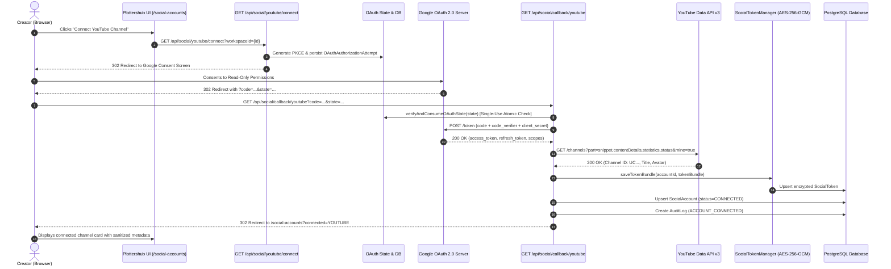

# YouTube OAuth 2.0 & Channel Connection Implementation (Phase 3.1)

## Executive Summary

Phase 3.1 implements the canonical **Google Cloud OAuth 2.0 and YouTube Channel Connection foundation** for Plottershub. It establishes secure server-side authorization, single-use state verification with PKCE S256 replay defense, zero-token client exposure, and canonical YouTube channel identity binding (`UC...`) stored through the centralized `SocialTokenManager`.

---

## Architecture & Implementation Matrix

| Component | Status | Description |
| :--- | :--- | :--- |
| **Google OAuth 2.0 Flow** | **IMPLEMENTED** | Server-side authorization URL generation (`access_type=offline`, `prompt=consent`) |
| **PKCE Replay Defense** | **IMPLEMENTED** | S256 challenge generation and cryptographic verifier storage in `OAuthAuthorizationAttempt` |
| **One-Time State Protection** | **IMPLEMENTED** | HMAC-signed state tokens atomically consumed via PostgreSQL single-row update |
| **Canonical Identity Mapping**| **IMPLEMENTED** | YouTube Channel ID (`UC...`) from `channels.list(mine=true)` mapped to `externalAccountId` |
| **Encrypted Token Management**| **IMPLEMENTED** | Centralized `SocialTokenManager` using AES-256-GCM (`v1:{iv}:{auth_tag}:{ciphertext}`) |
| **Social Account Upsert** | **IMPLEMENTED** | Idempotent upsert by `(workspaceId, platformId, externalAccountId)` with audit logging |
| **Video Ingestion & Sync** | **NOT IMPLEMENTED / PHASE 3.2** | `playlistItems.list`, `videos.list` scheduled background workers |
| **YouTube Analytics API** | **NOT IMPLEMENTED / PHASE 3.2** | Daily metrics queries (`reports.query`) and audience retention curves |
| **Comments & Community** | **FUTURE PHASE (Phase 4)** | `commentThreads.list`, `comments.insert`, moderation workflows |
| **Video Upload & Publishing** | **FUTURE PHASE (Phase 5)** | Resumable media uploads, thumbnail attachments, scheduled publishing |

---

## Google Cloud Console Configuration

### 1. API Enablement
Ensure the following APIs are enabled in your Google Cloud Project:
- **YouTube Data API v3**
- **YouTube Analytics API**
- **Google People API / User Info**

### 2. OAuth Consent Screen
- **User Type**: External (or Internal if restricted to Google Workspace organization)
- **App Name**: Plottershub
- **User Support Email**: `support@plottershub.com`
- **Authorized Domains**: `plottershub.com` (or `localhost` for development)
- **Scopes (Least Privilege)**:
  - `openid` (Basic identity verification)
  - `https://www.googleapis.com/auth/userinfo.profile` (Profile verification)
  - `https://www.googleapis.com/auth/youtube.readonly` (Read YouTube channel data and metadata)
  - `https://www.googleapis.com/auth/yt-analytics.readonly` (Read YouTube Analytics reports)

> [!IMPORTANT]
> Do NOT configure `youtube.upload` or `youtube.force-ssl` in this phase. The OAuth consent screen must maintain least privilege.

### 3. OAuth 2.0 Client Credentials
Create an **OAuth 2.0 Client ID** of type **Web application**:
- **Authorized JavaScript Origins**:
  - Local: `http://localhost:3000`
  - Production: `https://app.plottershub.com`
- **Authorized Redirect URIs**:
  - Local: `http://localhost:3000/api/social/callback/youtube`
  - Production: `https://app.plottershub.com/api/social/callback/youtube`

---

## Environment Variables Configuration

Add the following variables to `.env.local` (local development) and your production secrets manager:

```env
# Google OAuth 2.0 Credentials (Server-Side Only)
GOOGLE_CLIENT_ID="<your-client-id>.apps.googleusercontent.com"
GOOGLE_CLIENT_SECRET="<your-client-secret>"
GOOGLE_OAUTH_REDIRECT_URI="http://localhost:3000/api/social/callback/youtube"

# Platform & Token Encryption Keys
AUTH_SECRET="<minimum-32-character-cryptographic-secret>"
TOKEN_ENCRYPTION_KEY="<32-byte-hex-encoded-aes-gcm-key>"
```

> [!CAUTION]
> Never prefix `GOOGLE_CLIENT_SECRET` or `TOKEN_ENCRYPTION_KEY` with `NEXT_PUBLIC_`. These secrets must never enter client bundles.

---

## End-to-End OAuth Sequence



---

## Canonical Channel Identity Rules

1. **Canonical Account ID**: The primary key for the social account identity is strictly the YouTube Channel ID (`UC...`) obtained from `channels.list?mine=true`.
2. **Google Email Exclusion**: The Google account email is explicitly **NOT** used as the `externalAccountId`, because a single Google login can manage multiple brand channels, and channel identities must be deterministic across token renewals.
3. **Username & Handle**: The creator's `@handle` (`snippet.customUrl`) is cleaned of leading `@` symbols and used as `username`. If no custom URL is configured, the channel title or channel ID is used as fallback.
4. **Idempotent Upsert**: Accounts are unique per `(workspaceId, platformId, externalAccountId)`. Re-authenticating an existing channel safely updates access credentials and metadata without creating duplicates.

---

## Error Handling & Sanitization

Google OAuth and YouTube API errors are mapped to normalized, safe application error codes without exposing provider secrets or stack traces:

| Provider Error | Mapped Code | User Facing Status | Action Required |
| :--- | :--- | :--- | :--- |
| `invalid_grant` | `SOCIAL_TOKEN_REVOKED` | 400 Bad Request | Re-authentication prompt |
| `access_denied` | `SOCIAL_AUTH_REQUIRED` | 403 Forbidden | User rejected permissions |
| `quotaExceeded` | `SOCIAL_RATE_LIMITED` | 429 Too Many Requests | Backoff & retry scheduled |
| `channelNotFound` | `SOCIAL_ACCOUNT_RESTRICTED`| 404 Not Found | Prompt user to create YouTube channel |
| Tampered / Replayed State | `SOCIAL_STATE_REPLAYED` | 400 Bad Request | Flow aborted, restart required |

---

## Security Verification Summary

1. **State Replay Protection**: Verified through atomic PostgreSQL state consumption (`consumedAt`). Replayed callbacks are immediately rejected.
2. **PKCE Verification**: S256 challenges bound to server-persisted verifiers.
3. **Encrypted Token Isolation**: AES-256-GCM encrypted persistence in `SocialToken` with separate IV and authentication tags.
4. **Zero-Exposure Invariant**: `SocialAccountService.sanitizeAccount()` strips all token fields before sending data to client components or logs.
5. **Workspace Scoping**: RBAC checks enforce `social_accounts:connect` permissions bound to the current session and active workspace.
