# YouTube Initial Data Synchronization Pipeline Implementation (Phase 3.2)

## Executive Summary

Phase 3.2 implements the **YouTube Data API Synchronization Pipeline** for Plottershub. It enables reliable, quota-optimized, and idempotent ingestion of YouTube channels, uploads playlist discovery, batched video metadata resolution, public statistics capture, and snapshot persistence into `Content`, `ContentPlatform`, `ContentMetricSnapshot`, and `AccountMetricSnapshot`.

---

## Phase 3.2 Implementation Status Matrix

| Component | Status | Description |
| :--- | :--- | :--- |
| **Channel Synchronization** | **IMPLEMENTED** | `channels.list(mine=true)` profile, uploads playlist extraction (`UU...`), account statistics |
| **Uploads Playlist Discovery**| **IMPLEMENTED** | `playlistItems.list(playlistId=UU..., maxResults=50)` cursor-based traversal |
| **Batched Video Metadata** | **IMPLEMENTED** | `videos.list(id=id1..id50)` (1 quota unit per 50 videos) snippet, duration, status, statistics |
| **Content & Platform Upsert** | **IMPLEMENTED** | Idempotent mapping to `Content` and `ContentPlatform(externalContentId=videoId)` |
| **Content Metric Snapshots** | **IMPLEMENTED** | `ContentMetricSnapshot` with strict `NULL` vs `0` semantics and `BigInt` precision |
| **Account Metric Snapshots** | **IMPLEMENTED** | `AccountMetricSnapshot` bound to deterministic single `syncStartTime` |
| **Server Tenant Isolation** | **IMPLEMENTED** | `POST /api/social/youtube/sync` strictly accepts `{ accountId }`; derives workspace from session |
| **maxVideosLimit Guardrail**| **IMPLEMENTED** | Internal boundary (default 500, max 1000, rejects invalid/unbounded values) |
| **Bounded Transactions** | **IMPLEMENTED** | Per-batch `$transaction` commits preventing orphaned records on transient retries |
| **Audit Logging** | **IMPLEMENTED** | `SYNC_STARTED`, `SYNC_COMPLETED`, `SYNC_FAILED` recorded in `AuditLog` |
| **YouTube Analytics API** | **NOT IMPLEMENTED / PHASE 4** | Daily metrics (`reports.query`), watch time, traffic sources, audience retention |
| **Audience Demographics** | **NOT IMPLEMENTED / PHASE 4** | Age, gender, country distribution reports |
| **Comments & Community** | **NOT IMPLEMENTED / PHASE 4** | `commentThreads.list`, `comments.insert`, moderation workflows |
| **Publishing & Video Upload** | **NOT IMPLEMENTED / PHASE 5** | Resumable chunked upload protocol, thumbnails, native scheduling |

---

## Synchronization Architecture

```mermaid
sequenceDiagram
    autonumber
    actor Creator as Creator / Client
    participant SyncAPI as POST /api/social/youtube/sync
    participant SyncService as SocialSyncService
    participant TokenMgr as SocialTokenManager (AES-256-GCM)
    participant YTData as YouTube Data API v3
    participant DB as PostgreSQL Database

    Creator->>SyncAPI: POST { accountId } (Derived Tenant Isolation)
    SyncAPI->>SyncService: syncYouTubeAccount({ accountId, actorUserId, maxVideosLimit })
    SyncService->>DB: Verify SocialAccount ownership & social_accounts:manage RBAC
    SyncService->>DB: Create SyncJob (status=PROCESSING) & Log SYNC_STARTED
    SyncService->>TokenMgr: getValidAccessToken(accountId)
    TokenMgr-->>SyncService: Decrypted Valid Access Token
    
    rect rgb(30, 41, 59)
    Note over SyncService,YTData: Step 1: Channel Profile & Uploads Playlist (1 Quota Unit)
    SyncService->>YTData: GET channels.list(mine=true, part=snippet,contentDetails,statistics,status)
    YTData-->>SyncService: Channel Profile, Stats, Uploads Playlist ID (UU...)
    SyncService->>DB: Update SocialAccount metadata & Insert AccountMetricSnapshot (syncStartTime)
    end

    rect rgb(30, 41, 59)
    Note over SyncService,YTData: Step 2: Batched Playlist & Video Ingestion (2 Quota Units per 50 Videos)
    loop While pageToken && videosProcessed < limit
        SyncService->>YTData: GET playlistItems.list(playlistId=UU..., maxResults=50, pageToken)
        YTData-->>SyncService: Page of up to 50 Video IDs
        SyncService->>YTData: GET videos.list(id=id1..id50, part=snippet,statistics,contentDetails,status)
        YTData-->>SyncService: Batch Metadata, Durations & Statistics
        SyncService->>DB: $transaction: Upsert Content + ContentPlatform + ContentMetricSnapshot
    end
    end

    SyncService->>DB: Update SocialAccount.status=HEALTHY, lastSyncedAt=now()
    SyncService->>DB: Update SyncJob.status=COMPLETED & Log SYNC_COMPLETED
    SyncService-->>SyncAPI: 200 OK (Sanitized summary metrics)
    SyncAPI-->>Creator: Returns { success: true, videosDiscovered, videosCreated, videosUpdated, snapshotsCreated }
```

---

## Quota Efficiency Analysis

Routine video synchronization strictly uses the **Uploads Playlist Discovery Pattern**:
- `channels.list(mine=true)`: **1 quota unit**
- `playlistItems.list(playlistId="UU...", maxResults=50)`: **1 quota unit per page of 50**
- `videos.list(id="id1..id50")`: **1 quota unit per batch of 50**

**Quota Comparison (Channel with 500 Videos):**
- Standard Uploads Playlist Sync: $1 + 10 \times (1 + 1) = \mathbf{21\text{ quota units}}$
- Naive `search.list` implementation: $10 \times 100 = \mathbf{1,000\text{ quota units}}$
- **Efficiency Gain:** **97.9% reduction in API quota consumption.**

---

## Strict Metric Mapping & Nullability Invariant

| Metric Field | DB Column | Database Type | API Source | Nullable Semantics |
| :--- | :--- | :--- | :--- | :--- |
| `statistics.viewCount` | `views` | `BigInt?` | `videos.list` | Exact `0n` if returned `"0"`, parsed to `BigInt` |
| `statistics.likeCount` | `likes` | `BigInt?` | `videos.list` | Exact `0n` if returned `"0"`, parsed to `BigInt` |
| `statistics.commentCount` | `comments` | `BigInt?` | `videos.list` | Exact `0n` if returned `"0"`, `null` if disabled/omitted |
| *Unsupported* | `shares` | `BigInt?` | N/A | **STRICT NULL:** YouTube Data API does not expose video shares |
| *Unsupported* | `saves` | `BigInt?` | N/A | **STRICT NULL:** YouTube Data API does not expose video saves |
| *Analytics API Only* | `followersGained` | `BigInt?` | N/A | `null` (Reserved for Phase 4 Analytics API) |
| `statistics.subscriberCount` | `followersCount`| `BigInt?` | `channels.list` | BigInt subscriber count from channel metadata |
| `statistics.videoCount` | `totalVideos` | `BigInt?` | `channels.list` | BigInt total uploaded videos |
| `statistics.viewCount` | `totalViews` | `BigInt?` | `channels.list` | BigInt total channel views |

---

## Conservative Missing & Deleted Video Policy

1. **Explicit Deletions**: If `videos.list` returns a video with `status.uploadStatus === "deleted"` or `"rejected"`, Plottershub marks `Content.status = ARCHIVED` and `ContentPlatform.status = CANCELLED`.
2. **Private & Unlisted Videos**: Marked as `Content.status = PUBLISHED` and `ContentPlatform.status = PUBLISHED`.
3. **Pagination Omission**: Videos omitted from a partial page are NOT marked as deleted.
4. **Database Retention**: Records are **never** hard-deleted from PostgreSQL, ensuring audit integrity and historical time-series analytics continuity.

---

## Security & Tenant Isolation Guarantees

1. **Server-Derived Context**: The synchronization endpoint rejects client-supplied `workspaceId`. It verifies that the authenticated user holds `social_accounts:manage` role on the target `SocialAccount.workspaceId`.
2. **Zero-Token Exposure**: Access and refresh tokens are decrypted strictly in server memory via `SocialTokenManager` and never returned in API responses or UI components.
3. **Transaction Boundaries**: Each 50-video batch runs inside an atomic Prisma `$transaction`. Transient network failures roll back the active batch, preventing duplicate snapshot pollution on retry.
